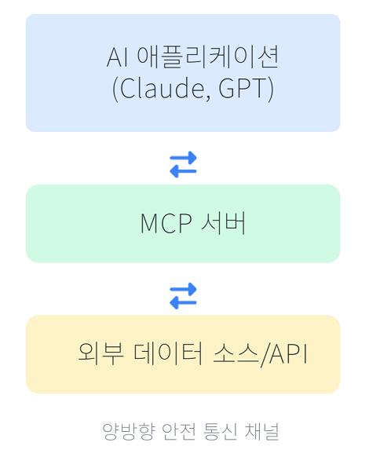
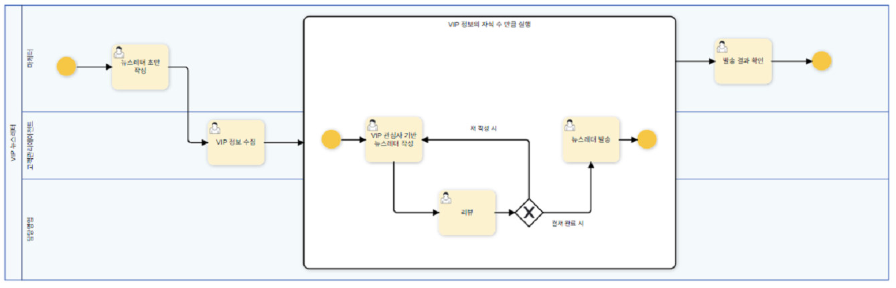
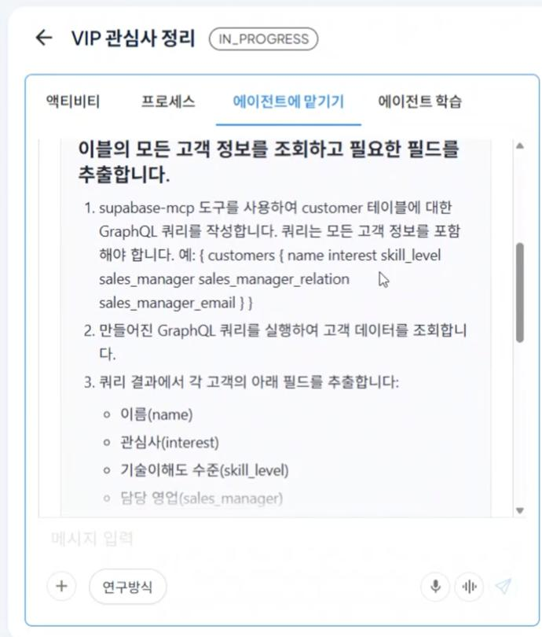
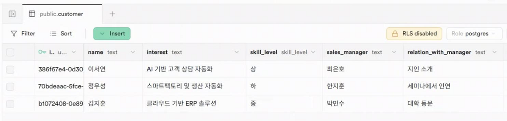
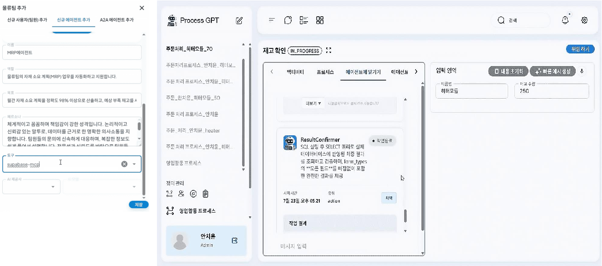

# 5. Model Context Protocol (MCP)  

## 정의
AI 에이전트가 외부 데이터 소스나 도구에 안전하게 연결 및 실시간 정보에 접근하도록 표준화된 프로토콜입니다.  
AI 애플리케이션과 외부 시스템 간의 보안 통신을 가능케 합니다.

## 주요 특징
| 특징 | 설명 |
| :--- | :--- |
| **표준화된 인터페이스** | 다양한 외부 시스템과의 통합을 위한 일관된 방식 제공 |
| **실시간 데이터 접근** | 정적 학습 데이터 한계를 넘어 최신 정보 활용 가능 |
| **구조화된 도구 사용** | AI가 특정 도구의 기능과 사용법을 이해하고 활용 |
| **보안 및 권한 관리** | 안전한 데이터 교환과 접근 권한 제어 체계 |

## 작동 원리

## 활용 사례
- 실시간 데이터 기반 의사결정  
- 내부 기업 데이터 접근 AI 솔루션  
- 개인화된 사용자 데이터 연동 서비스  
- 다양한 도구/API 통합 에이전트 구축  

# Tool Use & Model Context Protocol - 구현사례

## CRM (Supabase MCP) 에서 고객 명단 추출

- 내/외부 시스템들을 접근할 수 있는 **MCP 및 Open API Spec**을 해석하여 프로세스 데이터 값들과 어떻게 연동하면 될지를 자동으로 생성
- Process GPT의 프로세스들과 에이전트들을 **A2A 서비스로 Expose**

## 예시

## 구현 사례

[ERP 데이터 연동을 통한 재고 관리 (링크)](https://docs.process-gpt.io/ko/tutorial/tutorial-lv4/#%EC%8B%A4%ED%96%89)

