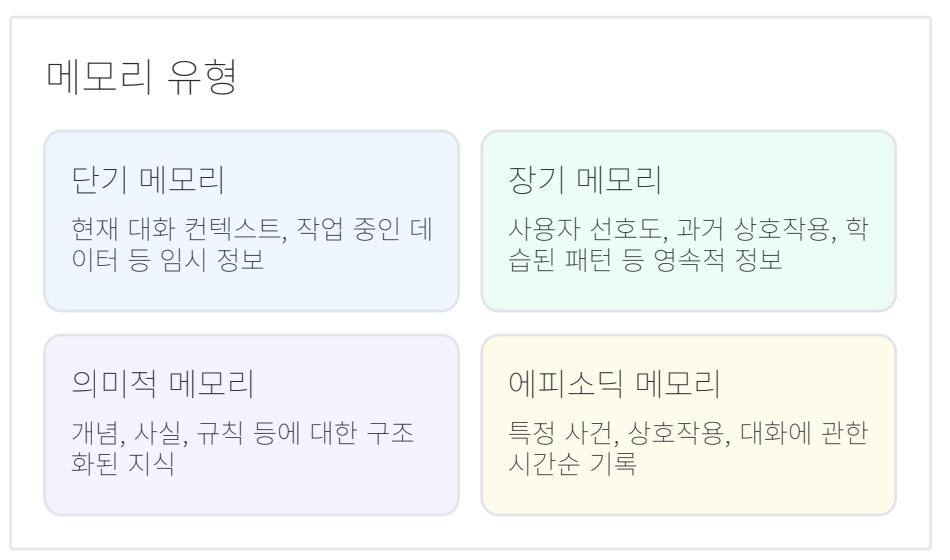

# 9. Memory Management

## 정의
이전 대화, 사용자 정보 등 컨텍스트를 장기적으로 기억/관리하는 패턴입니다.  
더 개인화된 서비스와 장기적인 대화 맥락 유지에 필수적인 기법입니다.

## 주요 특징
| 특징 | 설명 |
| :--- | :--- |
| **장단기 메모리 구조** | 즉각적인 컨텍스트와 장기 정보를 구분하여 관리 |
| **컨텍스트 유지** | 대화 및 작업 맥락을 유지하며 일관된 응답 제공 |
| **중요도 기반 저장** | 중요한 정보를 선별적 저장으로 효율적 메모리 사용 |
| **검색 최적화** | 필요한 정보를 빠르게 찾을 수 있는 벡터 저장소 활용 |

## 메모리 유형

## 활용 사례
- 장기 대화형 개인 비서  
- 개인화된 추천 시스템  
- 고객 서비스 에이전트  
- 교육용 AI 튜터  
- 맥락 인식 지원 시스템  

