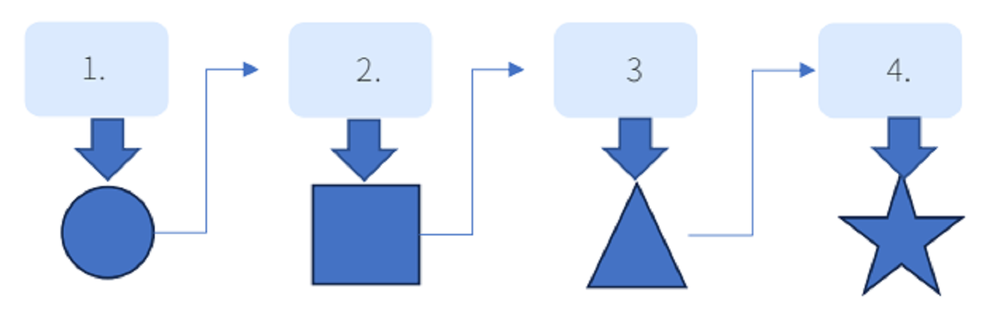
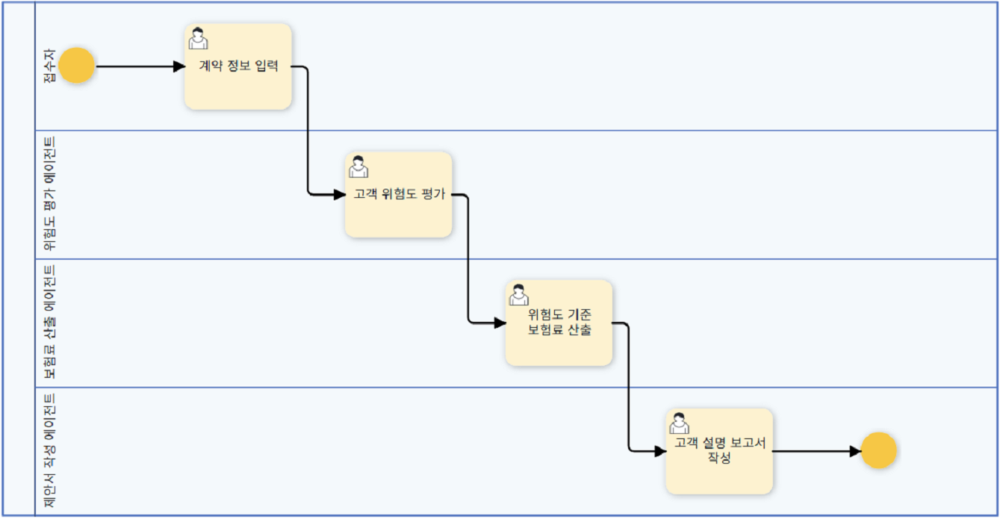

# 1. Prompt Chaining

## 정의

복잡한 과제를 단일 프롬프트가 아닌 여러 단계로 나눠 LLM 호출 결과를 순차적으로 연결하고, 에이전트 시스템과 MCP를 결합해 지능적으로 워크플로우를 자동화하는 핵심 기법입니다. 

## 주요 특징

* **순차적 의존성** : 이전 단계의 출력이 다음 단계의 입력으로 전달됩니다. 
* **작업 분해** : 복잡한 문제를 관리 가능한 하위 작업으로 분할합니다. 
* **단계별 최적화** : 각 단계마다 특화된 프롬프트로 결과 품질을 향상시킵니다. 
* **명확한 관찰 가능성** : 중간 결과를 모니터링하고 디버깅이 용이합니다. 

## 활용 사례

* 복잡한 텍스트 생성 (논문, 보고서) 
* 멀티스텝 추론 문제 해결 
* 코드 생성 파이프라인 
* 검색-분석-요약 워크플로우 

## 작동 원리

## 간단한 구현 예시 (작동 원리)

1. **초기 프롬프트 (계약 정보 입력)**:
   "고객의 나이, 직업, 건강 상태, 흡연 여부, 보험 종류를 입력하세요: [텍스트]."  
    이 단계는 전체 체이닝의 기반 데이터로 사용되며, 위험도 평가 단계의 입력값으로 사용 됩니다.

2. **두 번째 프롬프트 (위험도 평가)**:
   "입력된 계약 정보를 바탕으로 고객의 위험도를 평가하세요: [1단계 출력]."
    '건강 등급’, ‘흡연 여부’, ‘직업군’에 따라 점수를 산출하고 낮음, 중간, 높음으로 위험도를 출력하세요
  

3. **세 번째 프롬프트 (보험료 산출)**:
   "평가된 위험도를 기준으로 적정 보험료를 산출하세요: [2단계 출력]."
    기본요율은 50,000원이며 계산식은 보험료 = 기본요율 × (1 + 위험도 / 100) 입니다.
   
4. **네 번째 프롬프트 (고객 설명 보고서 작성)**:
   "계약 정보, 위험도 평가, 보험료 산출 결과를 종합하여 고객 설명 보고서를 작성하세요: [3단계 출력]."
    앞선 세단계의 출력을 순차적으로 호출하여 종합합니다.

## 🎬 예시 영상

ProcessGPT 보험 심사 프롬프트 체이닝 흐름을 시연한 영상입니다.

*영상이 안 보이면 [YouTube에서 보기](https://www.youtube.com/watch?v=7yXa___W9_M).*
