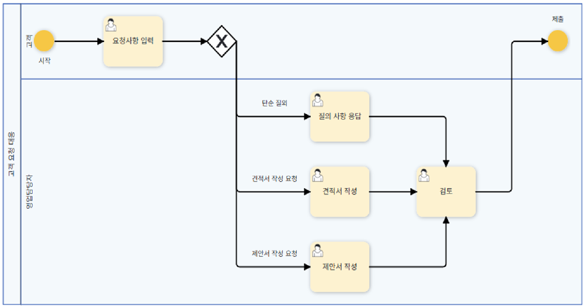
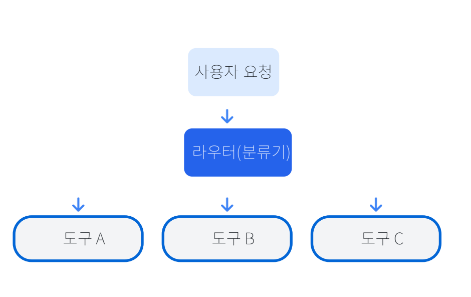

# 2. Routing (지능적 라우팅)

## 정의

다양한 에이전트/툴 중 요청에 따라 최적의 경로로 작업을 분기 및 분배하는 패턴입니다.  
멀티에이전트 시스템과 오케스트레이션에서 핵심 역할을 수행합니다. 

## 주요 특징

 **지능적 분배**  입력 분석을 통한 최적의 에이전트/도구 선택
 **조건부 로직**  입력 유형이나 내용에 따른 맞춤형 라우팅 결정
 **다단계 필터링**  복잡한 작업 분류를 위한 계층적 라우팅 구조
 **효율성 향상**  전문화된 에이전트/도구의 강점을 최적 활용

## 프레임워크 지원**  LangChain, LangGraph, Google ADK 등에서 라우팅을 지원합니다. |

## 구현 방식

 **LLM 기반 라우팅:** 자연어 입력을 카테고리 분류 (예: 주문조회, 기술지원 등)  
 **임베딩 기반 라우팅:** 시맨틱 유사도를 이용해 적합한 경로로 매칭  
 **룰 기반 라우팅:** 명시적 규칙/조건에 따른 결정  
 **머신러닝 기반 라우팅:** 학습된 분류기 기반으로 작업 경로를 지정  

## 라우팅 구조

## 간단한 구현 예시

