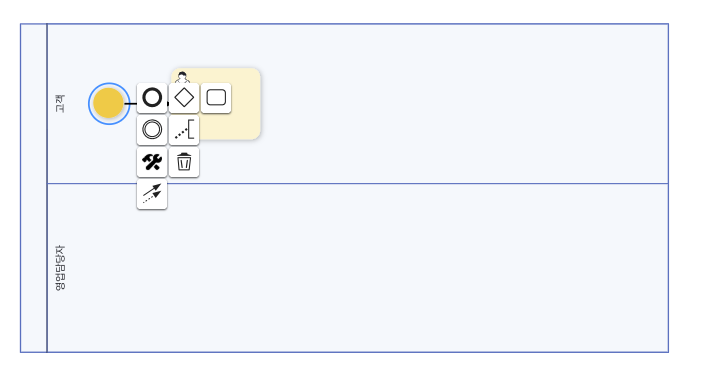
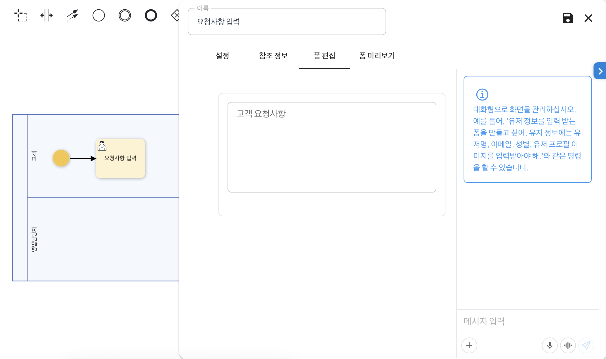
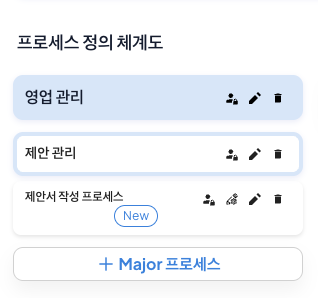
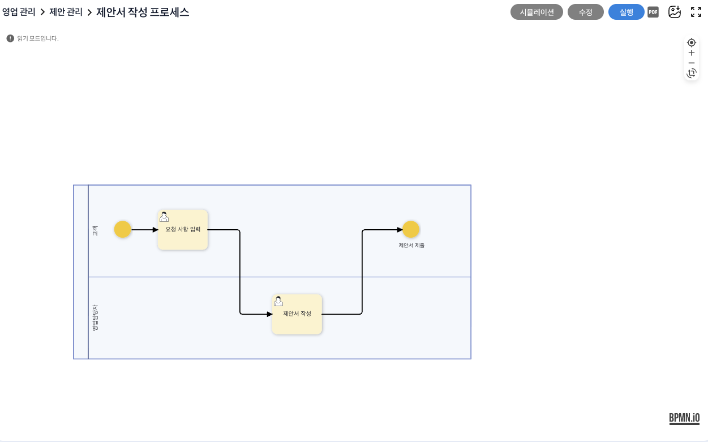
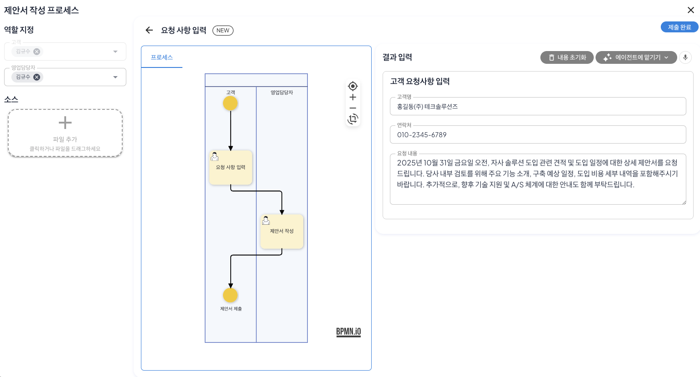
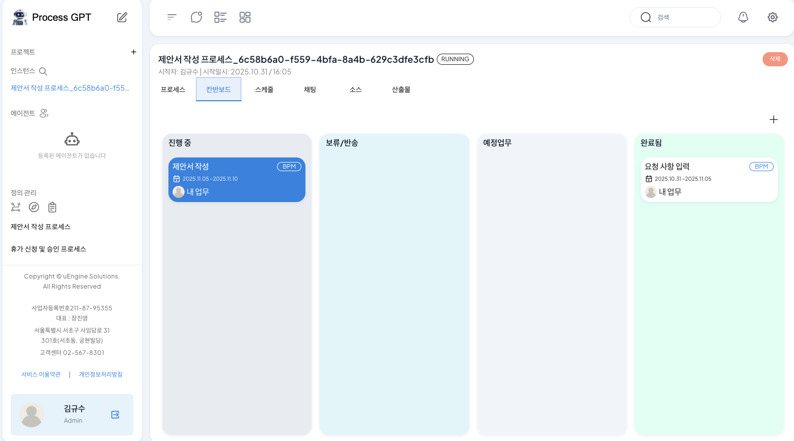

# 프로세스 생성과 실행

## 영업 제안서 작성 프로세스로 따라하는 ProcessGPT 튜토리얼 Lv.1

본 튜토리얼은 아래와 같은 영업 제안서 작성 과정을 통해 **ProcessGPT 사용법**을 소개합니다.  

영업 제안서 작성 프로세스: 
**고객 요청 입력 → 영업 담당자 제안서 작성**

### 프로세스 정의 화면 이동

좌측탭 "정의관리"의 "프로세스 정의"를 클릭하면 프로세스 정의 화면으로 이동할 수 있으며, 다음과 같은 기능을 지원합니다.  

1) 프로세스 정의 화면 상단에는 사용자가 수동으로 프로세스를 그릴 수 있도록 BPMN 팔레트가 배치되어 있습니다.   
BPMN 팔레트에 대한 자세한 설명은 참고 자료를 확인하시기 바랍니다.
[프로세스 정의 가이드](https://bpm-intro.uengine.io/bpm6-started/)

2) 프로세스 정의 화면 우측에는 사용자의 요구사항을 기반으로 AI를 통해 프로세스를 생성할 수 있습니다.

### 프로세스 정의
영업 제안서 작성 프로세스를 정의하기 위해 다음의 단계를 진행합니다.

1. 팔레트에서 "풀/참가자 생성(가로)" Drag&Drop을 통해 생성 후, 클릭하여 프로세스에 필요한 역할의 수에 맞게 레인을 정의합니다. 

    

    예) 고객, 영업 담당자

2. 팔레트에서 시작 이벤트를 고객 레인에 배치합니다. 이후, 시작 이벤트를 배치하였을때 표시되는 아이콘중 태스크를 선택하면 동일한 레인에 생성되는 것을 확인할 수 있습니다.  

3. 태스크를 더블 클릭하여 '요청사항 입력'으로 변경 후, '폼 편집' 탭으로 이동합니다.  

    폼 편집은 해당 태스크에서 입력할 정보를 기반으로 폼을 생성할 수 있으며 우측 화살표를 클릭하여 수동으로 생성하거나 요구사항을 기반으로 자동으로 생성할 수 있습니다.  
    

    폼 생성에 관한 자세한 설명은 참고 자료를 확인하시기 바랍니다. [폼 생성 가이드](https://bpm-intro.uengine.io/bpm6-started/form-definition/) 

1~3 을 통해 완성된 최종 영업 제안서 작성 프로세스는 다음과 같습니다.

## 프로세스 저장 및 수정

완료된 프로세스를 저장하기 위해 우측 영역의 저장 아이콘을 클릭한 후, 아래의 화면에 다음과 같이 입력합니다.

저장이 완료되면 '읽기 모드'로 변경되며 연필 아이콘을 클릭하여 프로세스를 수정할 수 있습니다.

 

## 프로세스 실행

생성한 프로세스를 실행하기 위해 좌측 상단 '프로세스 정의 체계도' 아이콘을 클릭하여 이동합니다. 

이후, 연필 아이콘을 클릭하여 정의 체계도를 편집모드로 활성화한후 아래와 같이 프로세스를 등록한 다음 저장합니다.

    Mega 프로세스: 영업 관리
    Major 프로세스: 제안 관리
    Sub 프로세스: 제안서 작성 프로세스

제안서 작성 프로세스를 클릭하며 정의된 프로세스를 확인할 수 있으며, 시뮬레이션 모드를 통해 프로세스를 검증하거나 실행을 통해 프로세스를 실행할 수 있습니다.

'실행'을 클릭하면 프로세스의 첫 단계인 제안서 작성 단계를 확인할 수 있으며 '역할 지정'과 '결과 입력'을 진행한 후, 제출 완료를 클릭하면 프로세스를 실행할 수 있습니다. 
이때, 역할 지정은 ProcessGPT에 가입한 사용자 혹은 등록된 Agent를 역할로 지정할 수 있습니다.  

결과 입력은 수동으로 입력하거나 '에이전트에 맡기기'를 클릭하면 해등 프로세스의 알맞은 입력값을 AI를 통해 생성할 수 있습니다.

제출 완료를 클릭하면 프로세스가 실행되며, 다음과 같은 결과를 확인할 수 있습니다.  

1. 인스턴스  
    프로세스 실행시 인스턴스에 실행한 프로세스가 등록되며 클릭시 세부 정보를 확인할 수 있습니다.

2. 칸반보드  
    제안서 작성 프로세스의 '칸반보드' 탭을 클릭하면 프로세스에 등록된 워크아이템 기반 현황을 파악할 수 있습니다.
    진행중과 예정업무의 경우 프로세스 진행간 자신의 레인에 해당된 업무가 표시됩니다.

이후, 제안서 작성 단계를 클릭하면 아래와 같이 생성되며 이전 단계에서 입력된 정보를 확인할 수 있습니다.

이때, '에이전트에 맡기기'를 진행할 경우 ProcessGPT에서 각 단계를 AI를 통해 자동으로 연결하는 **프롬프트 체이닝**과 각 단계에서 필요한 정보를 자동으로 추려 다음 단계에 전달하는 **컨텍스트 엔지니어링**을 통해 이전 단계에서 전달받은 정보를 기반으로 연결성 있는 결과가 생성됩니다.