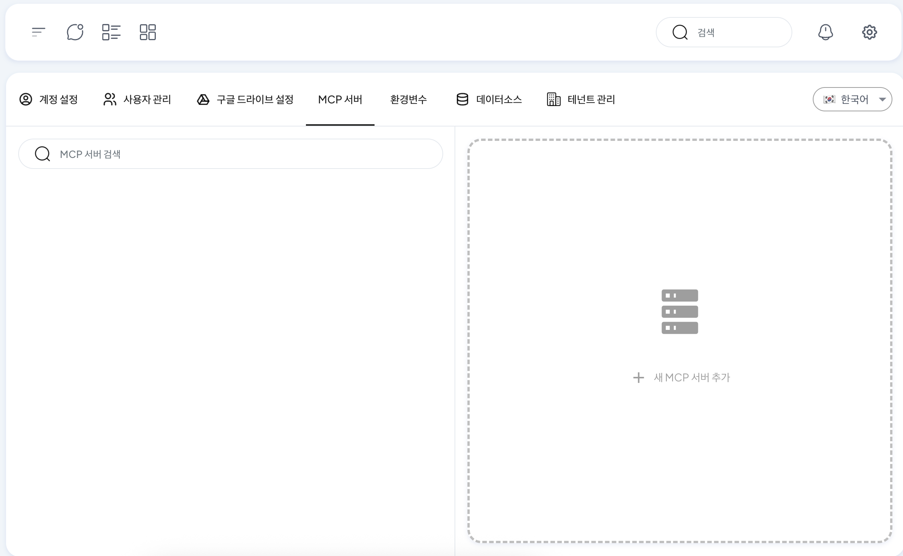
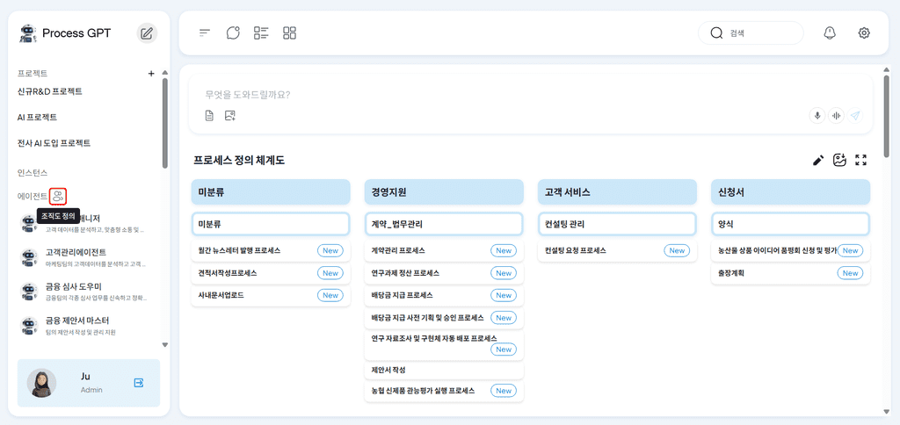
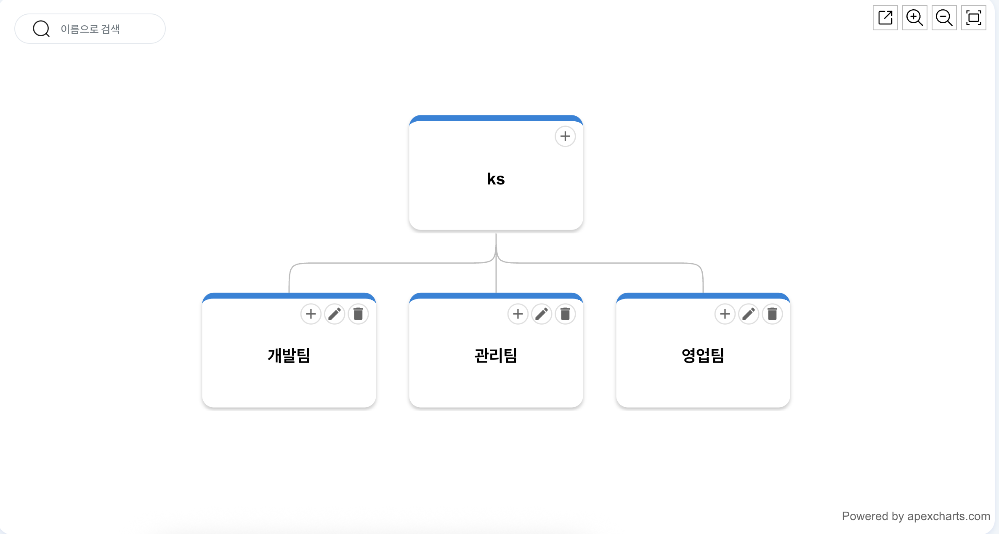
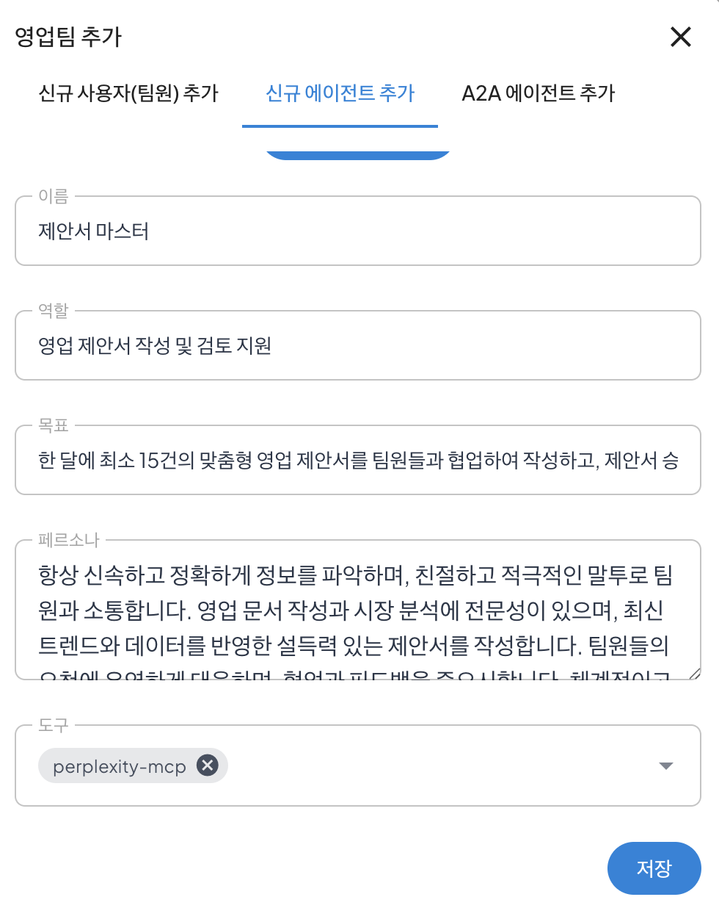
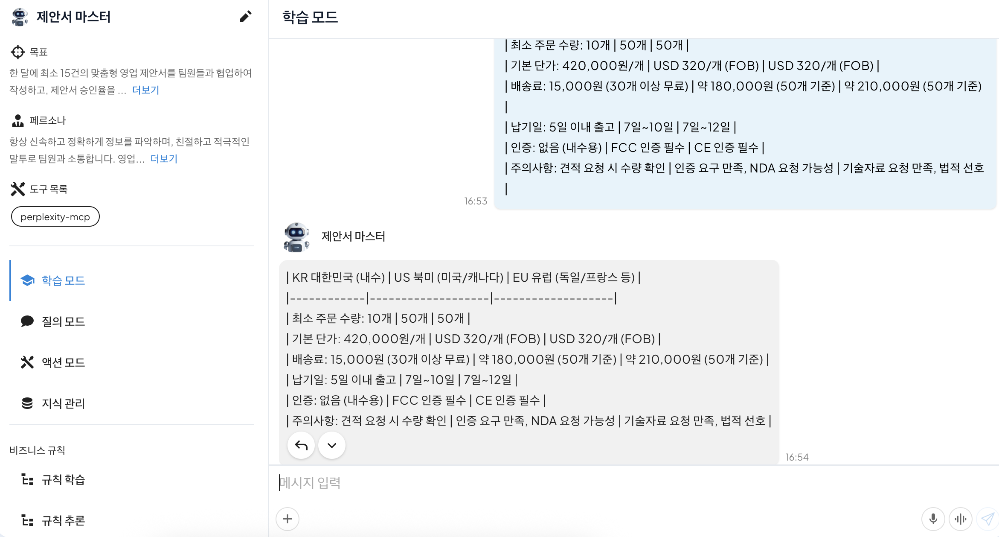
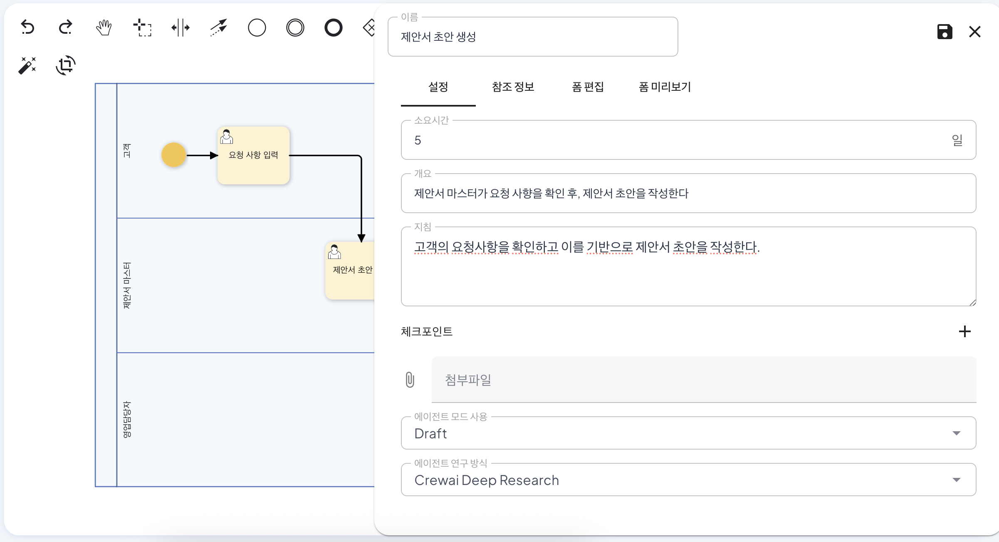
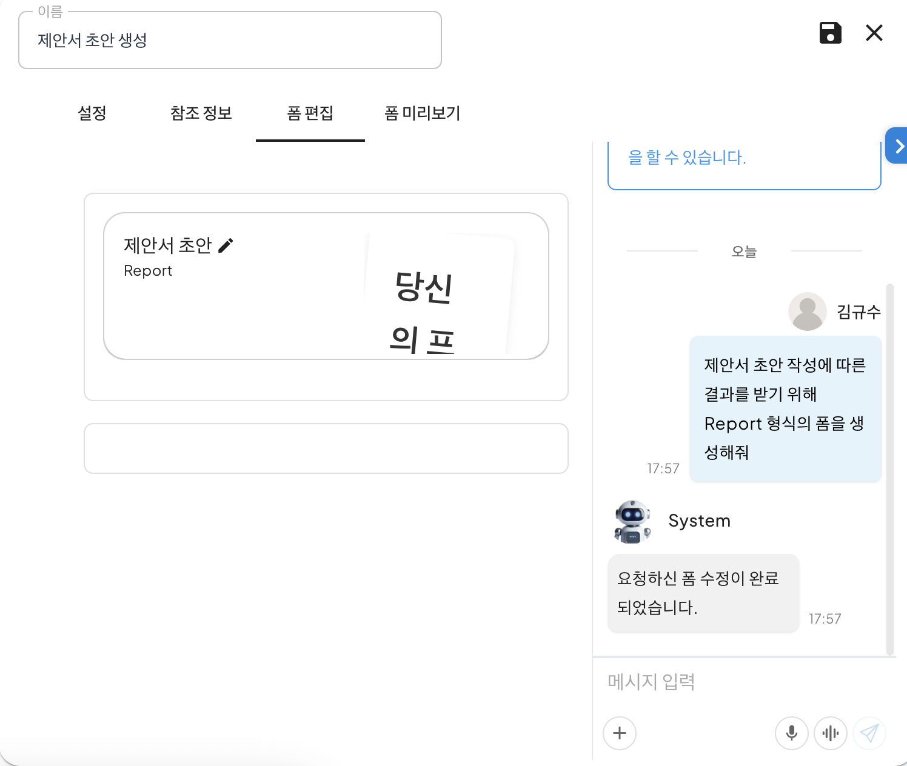
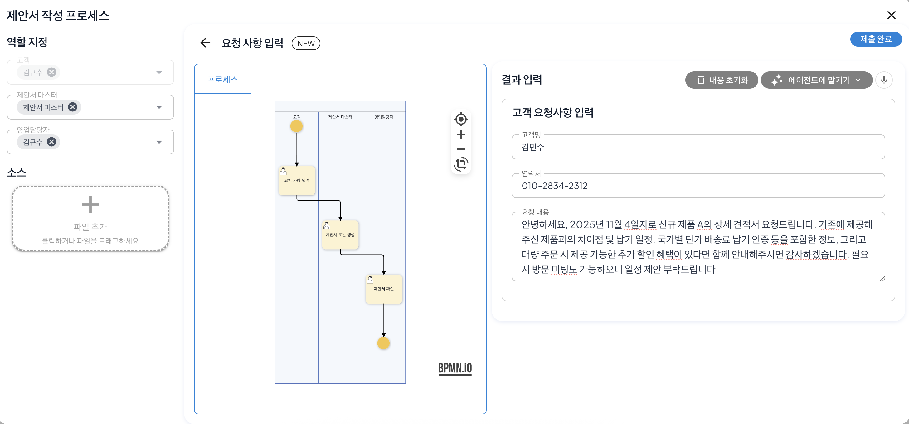
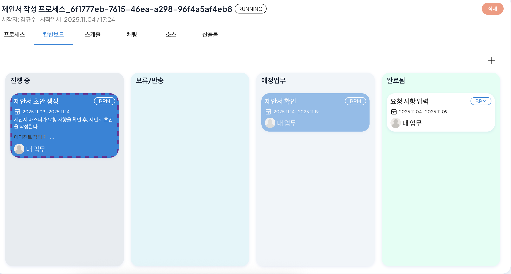
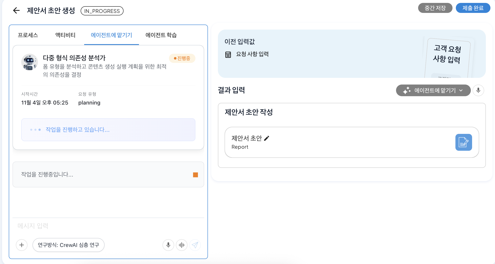

# AI 에이전트를 활용한 제안서 작성

## 영업 제안서 작성 프로세스로 따라하는 ProcessGPT 튜토리얼 Lv.2

본 튜토리얼은 아래와 같은 영업 제안서 작성 과정에서 AI 에이전트를 활용하는 방법을 안내합니다.

영업 제안서 작성 프로세스:<br>
**고객 요청 입력 → AI 에이전트에 의한 제안서 초안 생성 → 제안서 검토**

<video controls width="100%" preload="metadata" style="max-width: 960px; border-radius: 8px; margin: 1.5rem 0;">
  <source src="/videos/tutorial/tutorial-lv2-ai-agent-proposal-narrated.mp4" type="video/mp4">
  브라우저가 video 태그를 지원하지 않습니다. <a href="/videos/tutorial/tutorial-lv2-ai-agent-proposal-narrated.mp4">영상 다운로드</a>
</video>

> 💡 이 튜토리얼의 제안서 초안 생성은 기본 오케스트레이션인 **딥 에이전트(deepagents)**가
> 무인으로 수행합니다. 에이전트에게는 **학습(mem0)** 과 **DMN 결정 테이블**로 지식을
> 이중화해 주입합니다.

### (선택) MCP 등록

우측 상단 설정 → MCP 서버 탭으로 이동합니다. 해당 화면에서는 프로세스 진행 간 필요한 MCP(Model Context Protocol)를 등록할 수 있습니다. 기본으로 시드된 MCP 서버는 **읽기 전용 시드**이며, 이 튜토리얼의 제안서 초안 생성은 별도 외부 도구 없이 에이전트의 학습·프로필 지식만으로 동작하므로 **MCP 등록은 선택 사항**입니다. 외부 검색 등 도구가 필요할 때만 아래처럼 등록하시면 됩니다.


<br>
<br>
<br>

**새 MCP 서버 추가**를 클릭 후, 아래의 내용을 복사 및 붙여넣기를 통해 Perplexity MCP를 등록합니다.

```
{
    "mcpServers": {
        "perplexity": {
            "env": {
                "PERPLEXITY_MODEL": "sonar",
                "PERPLEXITY_API_KEY": "<YOUR_PERPLEXITY_API_KEY>" 
            },
            "args": [
                "perplexity-mcp"
            ],
            "command": "uvx",
            "enabled": true,
            "transport": "stdio"
        }
    }
}
```
<br>

### 에이전트 등록

1. 에이전트 옆에 있는 '+' 아이콘(조직도 추가 및 관리)를 클릭합니다.


<br>
<br>
<br>

생성된 조직도에서 영업팀을 조직에 새로 추가하기 위해 '팀 추가'를 클릭하여 영업팀을 추가합니다.


<br>
<br>
<br>

이후, 영업팀의 '신규 에이전트 추가' 탭을 클릭 → '**제안서 작성 에이전트**'를 입력 → 'AI로 에이전트 생성' 버튼을 클릭합니다.

이와 같은 과정을 통해 영업팀에서 사용할 업무와 관련된 새로운 에이전트를 생성할 수 있습니다.

AI를 통해 에이전트에 대한 임의 정보가 생성되는데 이를 확인 및 수정 후, 저장을 클릭하여 영업팀에 제안서 마스터 에이전트를 추가하면 아래와 같이 조직도가 업데이트되는 것을 확인할 수 있습니다.


<br>
<br>
<br>

### 에이전트 교육

생성된 에이전트에 사내 업무 관련 지식을 학습시켜 학습된 정보를 반영한 제안서를 생성하는 방법은 다음과 같습니다.

1. 등록된 제안서 마스터 에이전트를 클릭한 후 학습모드 채팅창에서 생성한 제안서 마스터 에이전트에게 제안서 작성에 필요한 사내 지식을 학습시킵니다.

이후 아래의 내용을 '메시지 입력' 영역에 추가한 후, Enter를 입력하여 에이전트에게 전달하면 학습이 진행됩니다.
```
아래는 제안서 작성에 필요한 내용이니 학습해

| KR 대한민국 (내수) | US 북미 (미국/캐나다) | EU 유럽 (독일/프랑스 등) |
|------------|-------------------|-------------------|
| 최소 주문 수량: 10개 | 50개 | 50개 |
| 기본 단가: 420,000원/개 | USD 320/개 (FOB) | USD 320/개 (FOB) |
| 배송료: 15,000원 (30개 이상 무료) | 약 180,000원 (50개 기준) | 약 210,000원 (50개 기준) |
| 납기일: 5일 이내 출고 | 7일~10일 | 7일~12일 |
| 인증: 없음 (내수용) | FCC 인증 필수 | CE 인증 필수 |
| 주의사항: 견적 요청 시 수량 확인 | 인증 요구 만족, NDA 요청 가능성 | 기술자료 요청 만족, 법적 선호 |
```
<br>

학습이 완료되면 아래와 같이 학습한 정보가 생성되며(에이전트 채팅의 **지식 관리** 탭에서 학습된 지식을 표로 확인·삭제할 수 있습니다), 제안서 초안 작성 시 학습한 정보를 기반으로 제안서 초안을 생성할 수 있습니다.


<br>
<br>
<br>

2. **규칙성 지식의 이중화 — DMN 결정 테이블 등록**

위에서 학습시킨 지역별 단가·납기·인증 표는 서술형 지식이 아니라 **조건(지역) → 결과(최소수량·단가·배송료·납기·인증)의 규칙성 지식**입니다. 학습(mem0)은 의미 검색 기반이라 이런 결정 규칙의 회수가 불안정할 수 있으므로, 같은 표를 **DMN 결정 테이블**로도 등록해 두는 것이 권장 사용법입니다.

에이전트 채팅 좌측의 **'비즈니스 규칙 +'** 를 통해 결정 테이블을 추가하면, 지역(region)을 입력으로 하고 최소수량·기본단가·배송료·납기·필수인증을 결과로 갖는 규칙표를 정의할 수 있습니다. 등록한 결정 테이블은 에이전트 채팅의 **'비즈니스 규칙'** 목록에 나타나며, `/dmn/<규칙 id>` 화면에서 결정 테이블 편집기로 그대로 열람·수정할 수 있습니다.

이렇게 **학습(mem0) + DMN 결정 테이블**로 지식을 이중화하면, 서술형 교육과 규칙성 지식의 구조적 관리·조회라는 서로 다른 표현을 함께 확보해 제안서 작성 품질을 높일 수 있습니다.

<br>
<br>

### 프로세스 생성 및 폼 수정

영업제안서 작성 프로세스를 아래와 같이 생성합니다.


<br>
<br>
<br>

제안서 초안 작성 task에 대한 설정을 진행하기 위해 더블 클릭하여 패널 생성 후 **에이전트** 탭에서 설정을 진행합니다.

이때 에이전트 탭에서는 **에이전트 연구 방식 = 딥 에이전트(deepagents)**, **완료 수준 = 초안(draft)** 으로 설정하고 **'미리 설정된 에이전트 사용'** 을 체크한 뒤 앞서 만든 제안서 작성 에이전트를 선택합니다. (완료 수준을 '초안'으로 두면 에이전트가 초안을 채워 두고 사람의 검토·제출을 기다립니다.)


<br>
<br>
<br>

설정이 완료되면 폼 편집 탭에서 에이전트를 통해 생성될 제안서 초안을 담을 폼을 생성합니다.

아래 내용을 우측 '메시지 입력' 영역에 복사 및 붙여넣기 후, Enter를 입력하여 제안서 초안에 대한 폼을 생성합니다.


<br>
<br>
<br>

```
제안서 초안 작성에 따른 결과를 받기 위해 Report 형식의 폼을 생성해줘
```

최종 폼이 생성되면 프로세스를 저장한 후, 프로세스 정의 체계도에서 제안서 작성 프로세스를 실행합니다.


### 에이전트의 제안서 작성

제안서 작성 프로세스 실행 시 역할 지정에서 아래와 같이 제안서 마스터 추가를 진행하여 제안서 초안 생성 단계 때 제안서 마스터가 업무를 진행하도록 지정합니다.


<br>
<br>
<br>

요청 사항 입력 후, 칸반보드를 확인하면 제안서 초안 생성에 대하여 '에이전트 작업중'을 확인할 수 있습니다.


<br>
<br>
<br>

해당 워크아이템을 클릭 후, 에이전트에 맡기기 탭을 확인하면 에이전트에 의해 제안서 초안이 작성되는 과정을 확인할 수 있습니다.


<br>
<br>
<br>

작성이 완료되면 '결과 입력' 영역에 에이전트를 통해 생성된 제안서 초안이 나타나 확인할 수 있습니다.

제출 완료 후, 영업팀에서 제안서를 확인 후, 제출 완료를 진행하면 프로세스가 종료됩니다.