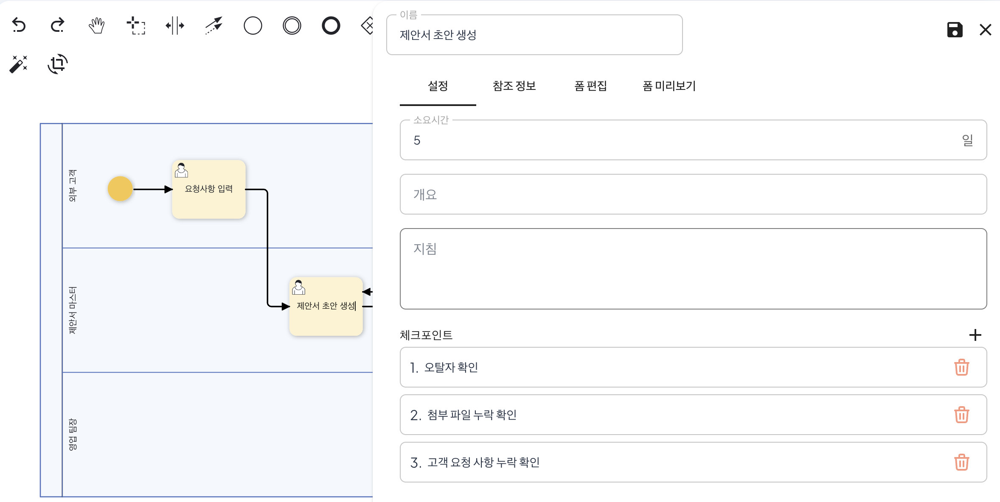
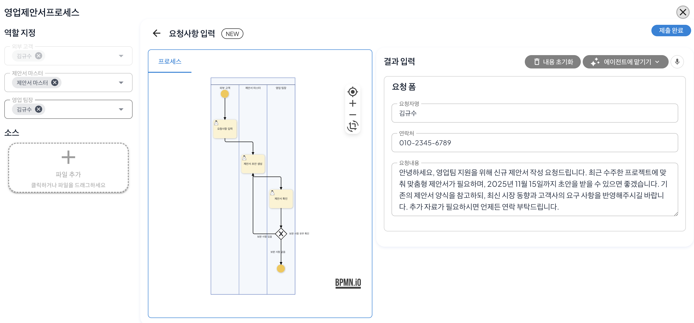
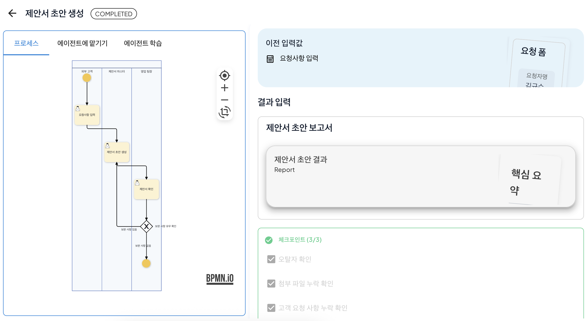
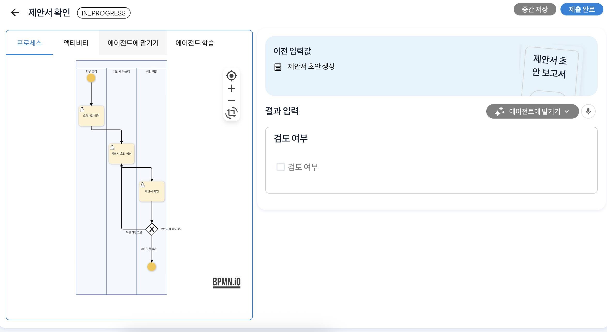
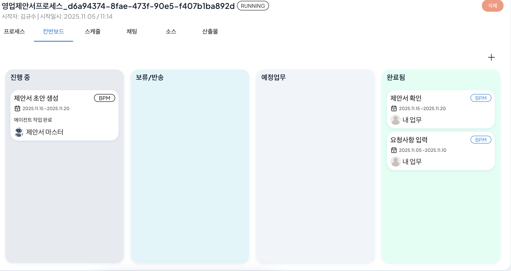
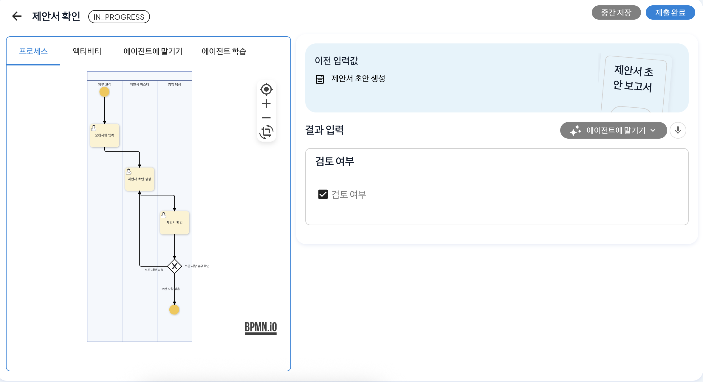

# 조건 분기 설정과 피드백 반영

## 영업 제안서 작성 프로세스로 따라하는 ProcessGPT 튜토리얼 Lv.3

본 튜토리얼은 아래와 같은 영업 제안서 검토 과정을 통해 **조건 분기 설정 방법**을 소개합니다.  

영업 제안서 작성 프로세스: 
**고객 요청 입력 → 제안서 초안 작성 → 제안서 확인** 

제안서 작성시 오탈자, 첨부 자료 누락, 고객 요청 반영 여부에 대한 검토는 에이전트가, 전략적 판단이 필요한 검토는 영업팀 팀장이 수행합니다.

### 프로세스 수정

이번 내용에서는 기존의 영업 제안서 작성 프로세스에 **게이트웨이**를 추가하여 프로세스에서 특정 조건의 부합 여부에 따라 서로 다른 경로로 프로세스가 진행되도록 하는 기능인 조건 분기를 설정합니다. 

제안서 확인 ~ 프로세스 종료 사이에 게이트웨이를 배치한 후 연결합니다. 게이트웨이를 더블 클릭 후, **보완 사항 유무 확인**을 입력합니다.   이후, 프로세스 종료와 제안서 초안 작성 각각에 연결 후, '보완 사항 있음/없음'에 대한 입력을 각각의 플로우에 진행합니다. 

조건 분기 설정이 완료되면 제안서 초안 작성에 체크리스트를 설정합니다. 작성 단계에서 오탈자, 첨부 자료 누락, 고객 요청 반영 여부를 확인하기 위해 제안서 초안 작성을 더블 클릭하여 패널 생성 후, 아래와 같이 체크포인트 영역의 '+'를 통해 추가합니다. 

프로세스를 저장한 후, 정의 체계도로 이동하여 프로세스를 실행합니다. 

### 프로세스 실행

제안서 초안 생성 단계를 확인하면 우측 하단 영역에 체크포인트 영역에 이전에 설정한 체크리스트가 표시되는걸 확인할 수 있습니다. 

해당 체크리스트가 부합되는지를 판단하였을때 모든 체크리스트가 부합되면 프로세스가 다음 단계로 진행됩니다. 

이후, 제안서 확인 단계에서 영업팀장에 의해 검토 여부를 파악하고 재작성이 필요한 경우 다음과 같이 검토 여부 체크해제 후, 제출을 진행하면 다시 '제안서 초안 생성' 단계로 돌아가 프로세스가 진행됩니다.

 
 

초안이 재작성이 이루어지면 '제안서 확인' 단계가 다시 진행되며 검토 여부 확인 후, 보완 필요한 사항이 존재하지 않아 검토 여부를 체크하면 프로세스는 종료됩니다. 

 

이를 통해 조건 분기 설정을 통한 프로세스 재진행과 체크리스트를 통한 피드백 반영을 진행할 수 있습니다. 