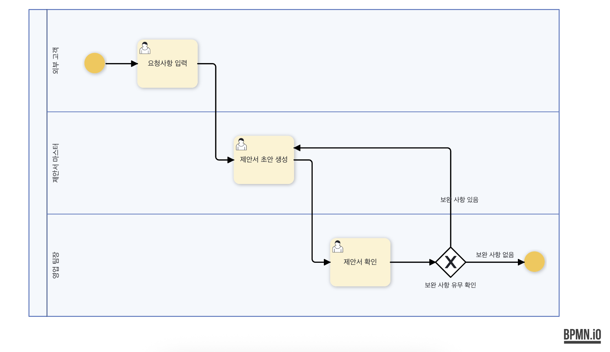
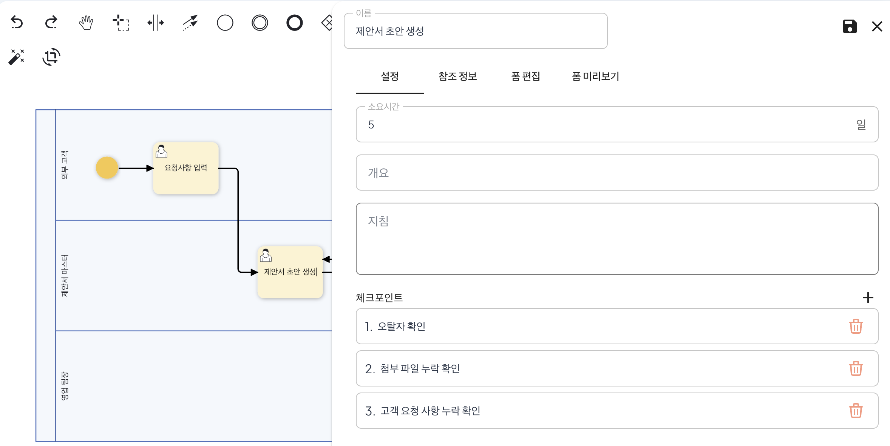
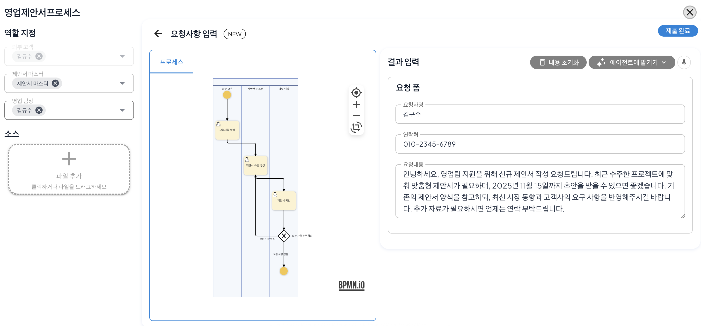
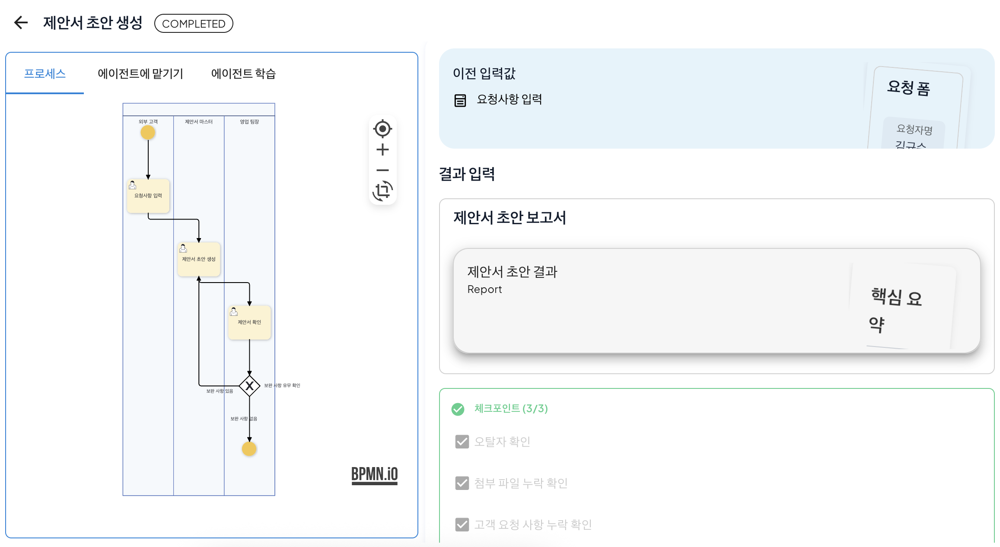
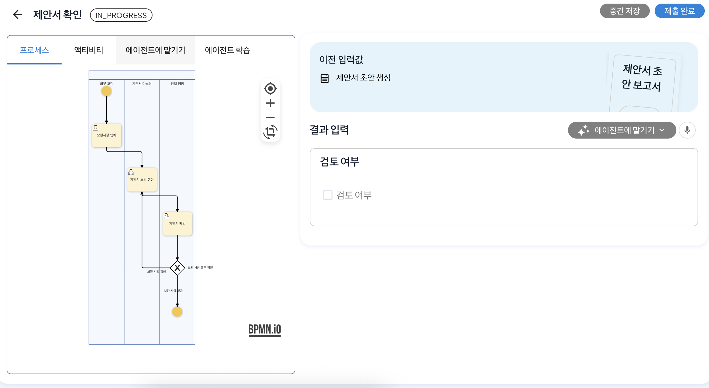
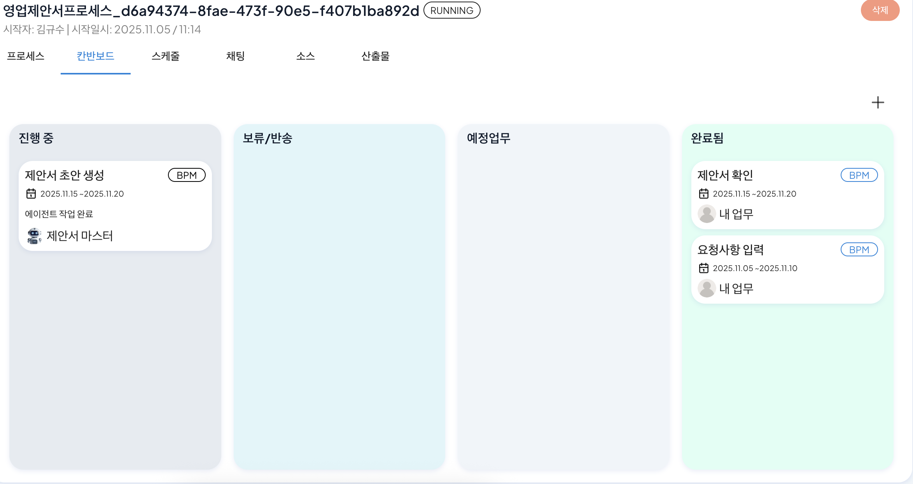
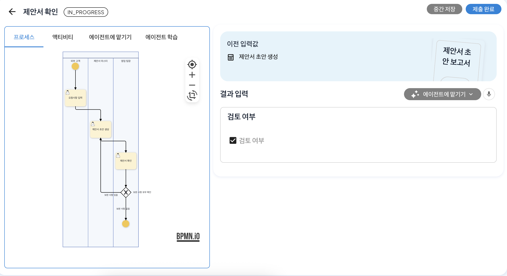

# 조건 분기 설정과 피드백 반영

## 영업 제안서 작성 프로세스로 따라하는 ProcessGPT 튜토리얼 Lv.3

본 튜토리얼은 아래와 같은 영업 제안서 검토 과정을 통해 **조건 분기 설정 방법**을 소개합니다.

영업 제안서 작성 프로세스: 
**고객 요청 입력 → 제안서 초안 작성 → 제안서 확인**

제안서 작성시 오탈자, 첨부 자료 누락, 고객 요청 반영 여부에 대한 검토는 에이전트가, 전략적 판단이 필요한 검토는 영업팀 팀장이 수행합니다.

<video controls width="100%" preload="metadata" style="max-width: 960px; border-radius: 8px; margin: 1.5rem 0;">
  <source src="/videos/tutorial/tutorial-lv3-conditional-feedback-narrated.mp4" type="video/mp4">
  브라우저가 video 태그를 지원하지 않습니다. <a href="/videos/tutorial/tutorial-lv3-conditional-feedback-narrated.mp4">영상 다운로드</a>
</video>

### 프로세스 수정 (BPMN 편집기 직접 조작)

이번 내용에서는 기존의 영업 제안서 작성 프로세스를 **BPMN 편집기에서 직접 편집**해, 특정 조건의 부합 여부에 따라 서로 다른 경로로 진행되는 **조건 분기(게이트웨이)** 와 검토 기준인 **체크포인트**를 설정합니다.

`/definitions/<프로세스 id>` 화면에서 우측 패널의 **연필 아이콘**을 눌러 편집 모드로 전환하면(‘읽기 모드입니다’ 표시가 사라짐) 도형 팔레트와 편집 도구가 나타납니다.

1. **게이트웨이 배치·조건 입력**: 제안서 확인 ~ 프로세스 종료 사이에 배타 게이트웨이를 배치하고 더블 클릭하여 **보완 사항 유무 확인**을 입력합니다. 이후 게이트웨이를 프로세스 종료·제안서 초안 작성에 각각 연결한 뒤, **분기 플로우를 더블 클릭**하면 조건 편집 패널이 열립니다. 조건 필드에 '보완 사항 있음/없음' 과 같은 **자연어 조건**을 입력하고, 프리펜드 아이콘으로 **함수 모드**로 전환하거나 **'결정론적 규칙화'** 버튼을 눌러 자연어 조건을 결정론적 규칙(condition function)으로 변환합니다.  
자연어 조건만 저장하면 런타임이 LLM 평가 경로로 동작해 분기가 불안정할 수 있으므로, 확실한 분기가 필요하면 **결정론적 규칙(예: `needs_revision == 'true'` / `== 'false'`)** 으로 저장하는 것을 권장합니다.

 

2. **체크포인트 추가**: 조건 분기 설정이 완료되면 제안서 초안 작성 단계에 체크리스트를 설정합니다. 제안서 초안 작성을 더블 클릭하여 패널을 연 뒤 **설정** 탭에서 체크포인트 영역의 '+'를 통해 오탈자·첨부 자료 누락·고객 요청 반영 여부 등을 추가합니다.

 

저장 아이콘을 눌러 **'버전 업' 다이얼로그**에서 저장한 후, 정의 체계도로 이동하여 프로세스를 실행합니다.

 

### 프로세스 실행

제안서 초안 생성 단계를 확인하면 우측 하단 영역 체크포인트 영역에 이전에 설정한 체크리스트가 표시되는 것을 확인할 수 있습니다.

해당 체크리스트가 부합되는지를 판단하였을 때 모든 체크리스트가 부합되면 프로세스가 다음 단계로 진행됩니다.
  

이후, 제안서 확인 단계에서 영업팀장에 의해 검토 여부를 파악하고 재작성이 필요한 경우 다음과 같이 검토 여부 체크 해제 후, 제출을 진행하면 다시 '제안서 초안 생성' 단계로 돌아가 프로세스가 진행됩니다.

 

초안이 재작성이 이루어지면 '제안서 확인' 단계가 다시 진행되며 검토 여부 확인 후, 보완 필요한 사항이 존재하지 않아 검토 여부를 체크하면 프로세스는 종료됩니다.

이를 통해 조건 분기 설정을 통한 프로세스 재진행과 체크리스트를 통한 피드백 반영을 진행할 수 있습니다.