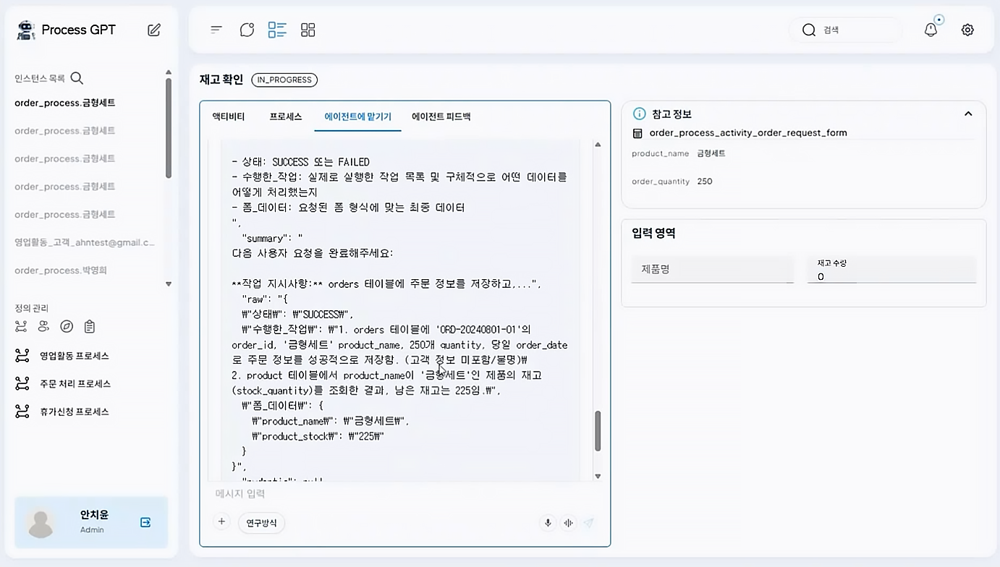

# ERP 데이터 연동을 통한 재고 관리

## 재고 관리 프로세스로 따라하는 ProcessGPT 튜토리얼 Lv.4

본 튜토리얼은 **AI 에이전트**와 ERP 데이터를 연동하여 수행하는 재고 관리 프로세스를 안내합니다. <br>
Supabase를 활용하여 데이터 테이블을 연동하고 에이전트를 통해 재고의 입·출고 처리 및 생산 요청들의 업무를 처리합니다.

### ERP 데이터 연동 (Supabase 활용)
설정 > 데이터소스 탭으로 이동하여 접속 정보를 추가합니다.<br>


이때, Supabase의 정보를 기반하여 접속정보를 추가해야하기 때문에 Supabase로 접속합니다. https://supabase.com/ <br>

가입 후, 조직 생성을 위해 'Create organization'을 클릭 후, Name을 설정하여 조직을 생성합니다. 


생성한 조직 > 'New Projsct'를 통해 Name, Region, Password를 입력하여 생성하면 아래와 같이 프로젝트가 생성된 것을 확인할 수 있습니다.


생성한 프로젝트 > 좌측 'Table Editor' > 'New table'을 클릭 후, 아래 내용을 참고하여 Product Table을 생성합니다.


| Name         | Type      |
|--------------|-----------|
| product_name   | text      |
| product_id     | text      |
| category       | text      |
| unit_price     | numeric   |
| unit           | text      |
| description    | text      |
| stock_quantity | numeric   |
| created_at   | timestamptz |

테이블 등록 후, 좌측 메뉴 'API Docs' > product_table > 우측 상단 'Bash'를 클릭하면 아래와 같은 화면이 생성되며, curl 하단 https://tjzssujilztwhzqbtgin.supabase.co/rest/까지 복사하여 접속 정보 URL에 추가합니다. <br>


이후, 상단 Connect > App Frameworks에 등록된 SUPABASE_ANON_KEY를 복사하여 접속 정보 Header Value에 추가합니다. <br>

최종 완성된 접속 정보는 아래와 같으며, 모든 정보를 추가한 후 저장합니다. <br>


### MRP 에이전트 등록 및 재고 관리를 위한 도구 부여

MRP 에이전트에 사용할 Supabase MCP를 등록하기 위해 설정 > MCP 서버 > '새 MCP 서버 추가'를 클릭하여 아래와 같이 입력합니다. <br>
이때 Access_Token은 Supabase 프로필 > Account preferences > Access Tokens로 이동하여 Token 발급 후 입력합니다. <br>
```
{
    "mcpServers": {
        "supabase": {
            "env": {
                "SUPABASE_ACCESS_TOKEN": ""
            },
            "args": [
                "-y",
                "@supabase/mcp-server-supabase@latest",
                "--project-ref",
                "vlkoplsvrpjldnpcelqb"
            ],
            "command": "npx",
            "enabled": true
        }
    }
}
```

MCP 설정 완료 후, 조직도 정의에서 물류팀을 등록합니다.


이후, 물류팀에서 '+' > '신규 에이전트 추가'를 클릭후 아래와 같이 입력한 다음 AI로 에이전트 생성을 진행합니다.
```
물류팀의 자제 소요 계획(MRP)업무를 자동화하고 지원합니다.
```
생성된 에이전트의 도구에 supabase MCP가 등록되어있는지 확인 후, 저장을 통해 MRP 에이전트를 추가합니다.


### 프로세스 생성 및 폼 수정

1. 프로세스를 아래와 같이 생성합니다. 


- 재고가 충분할 경우 → 즉시 출고 진행
- 재고가 부족할 경우 → 생산 요청 후, 입고 완료된 제품을 출고
<br><br>

2. 각 task의 폼을 용도에 맞게 수정합니다. task의 설정과 사용할 에이전트에 대한 설정, Supabase와의 연동을 아래와 같이 진행합니다.


<br>


<br>


3. 생성된 프로세스의 폼은 실제 ERP 데이터와 연동되어, 프로세스의 물품명, 단가, 재고가 Supabase의 **product name, unit price, stock quantity**와 연결됩니다.


<br>


### 실행

1. 프로세스를 실행하고 고객의 요청사항을 입력하면 에이전트가 재고 확인을 시작합니다.


<br>

2. 에이전트는 고객이 주문한 히터모듈의 재고가 주문량 70개보다 많은 것을 확인 후, 바로 출고를 진행합니다.


<br>

3. 에이전트는 출고 후 남은 재고 수량도 Supabase mcp를 통해 연동된 ERP 데이터를 확인할 수 있습니다.


<br>

4. 만약, 재고 수량이 고객의 주문 수량보다 부족할 경우, 재고 보충을 위해 금형세트 100대 생산을 요청합니다.




<br>

5. 생산이 완료되면 에이전트가 입고를 처리하며, ERP 데이터에서도 수량이 반영됩니다.


<br>

6. 이후 재고가 충분해지면 출고를 진행하고, 남은 재고 수량 역시 ERP에서 확인할 수 있습니다.


<br>

7. 출고가 완료되면 프로세스가 종료됩니다.
