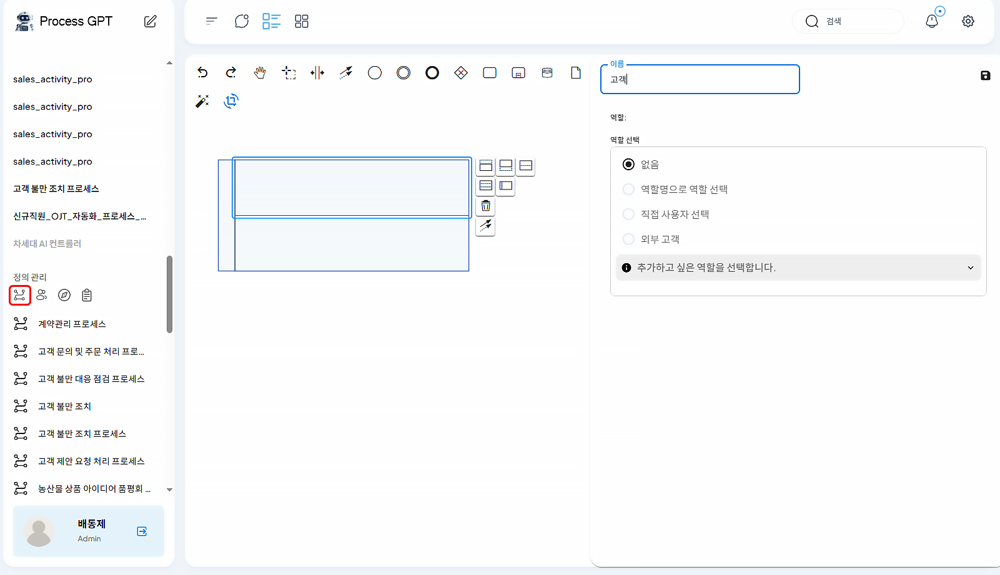
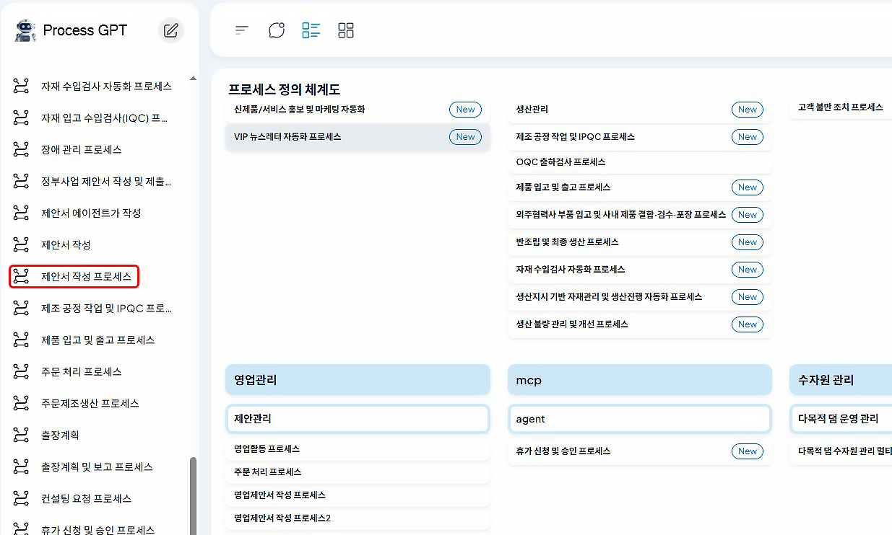

# 프로세스 생성과 실행

## 영업활동프로세스로 따라하는 ProcessGPT 튜토리얼 Lv.1

본 튜토리얼은 영업 제안서 작성 과정을 통해 **ProcessGPT 사용법**을 소개합니다. 
고객이 요청을 입력하면 영업 담당자는 빠른 예시 생성 기능을 활용해 제안서 초안을 손쉽게 마련할 수 있습니다.

### 프로세스 생성

좌측탭 “정의관리”의 “프로세스 정의” 클릭하면 직접 프로세스를 그릴 수 있습니다.

1. 상단의 “풀/참가자 생성(가로)” 클릭

- 생성된 풀 클릭 후 우측 아이콘에서 필요한 역할의 수만큼 레인을 나눌 수 있습니다. 
- 각 레인 별 역할 지정 후 우측 저장 아이콘 클릭
 

2. 시작 아이콘을 클릭하여 프로세스 시작을 설정합니다.

- 워크 아이템을 클릭하여 해당 레인에 배치합니다. 배치된 워크 아이템을 클릭하여 워크아이템의 이름과 특성을 입력합니다.
- 워크 아이템을 클릭하면 워크아이템 수정과 다른 요소로 연결이 가능합니다. “다른 요소에 연결”을 클릭하여 워크아이템 간의 순서를 지정할 수 있습니다.
 

3. 프로세스를 마칠 종료 아이콘을 추가 후 우측 저장 버튼을 눌러 프로세스를 저장합니다.

- 좌측 탭의 정의 관리 탭에서 생성된 프로세스를 확인할 수 있습니다.
 

### 프로세스 수정

1. 우측의 연필 아이콘을 클릭하면 프로세스를 수정할 수 있습니다.

 

2. 워크아이템의 폼을 자연어로 수정할 수 있습니다. 수정 후 우측 상단의 저장 버튼을 눌러야 저장이 완료됩니다. 수정 후 프로세스를 저장합니다.

 

3. 수정 시, 버전 관리를 통해 수정된 내용을 관리할 수 있습니다.

 

### 프로세스 실행

1. 프로세스 정의 체계도에서 사용할 프로세스를 클릭합니다.

 

2. 우측의 실행을 클릭합니다.

 

3. 좌측에서 역할을 지정하고, 고객의 요청 사항을 입력 후, 제출 완료를 클릭합니다.

 

4. 프로세스가 실행됩니다. 실행중인 프로세스는 좌측 인스턴스 목록에서 확인할 수 있습니다

 

5. 칸반보드를 클릭하면 유저에게 할당된 작업의 진행 현황을 확인할 수 있습니다.

 

6. 빠른 예시 생성 버튼을 클릭하면 고객의 주문 내용과 과거 데이터를 조회하여 ChatGPT 기반LLM이 자동으로 초안을 작성합니다. 작성된 내용을 확인 후 우측 상단의 제출 완료를 클릭합니다.

 

7. 칸반보드에서 유저에게 할당된 모든 업무가 완료된 것을 확인할 수 있습니다. 유저들에게 할당된 모든 업무가 종료되면 프로세스도 종료됩니다.

