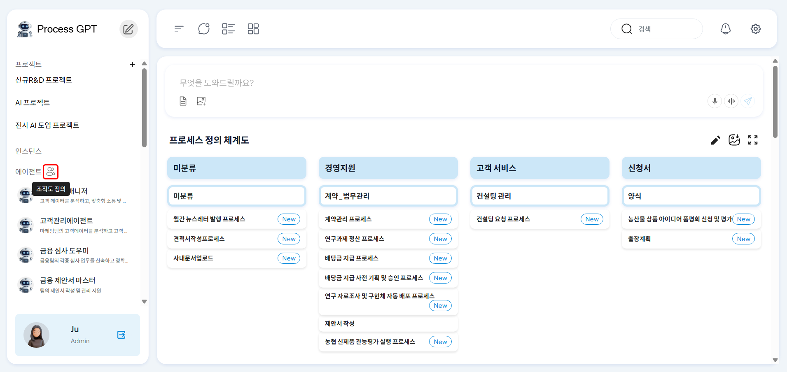

# AI 에이전트를 활용한 제안서 작성

## 영업활동프로세스로 따라하는 ProcessGPT 튜토리얼 Lv.2

본 튜토리얼은 **AI 에이전트**를 활용하여 영업 제안서를 작성하는 과정을 안내합니다.
고객의 요청사항을 확인하고 AI에이전트가 제안서 마스터로서 제안서 초안을 생성합니다. 생성된 초안은 사람인 영업팀 담당자가 검토합니다. 

### 에이전트 등록

1. 정의 관리에서 조직도 아이콘을 클릭합니다.

 

2. 영업팀을 조직도에 등록한 후, 제안서 작성에 특화된 신규 AI 에이전트를 생성합니다.

 

3. 제안서 작성에 특화된 에이전트 등록을 위해 역할, 목표, 페르소나를 묘사하고 제안서 작성에 필요한 도구를 부여합니다.

 

### 에이전트 교육

1. 화면 상단의 채팅창을 클릭하여 학습모드를 활성화 한 후, 생성한 제안서 마스터 에이전트에게 제안서 작성에 필요한 사내 지식을 학습시킵니다.

 

### 프로세스 생성 및 폼 수정

1. 프로세스를 생성합니다. “제안서 마스터”를 제안서 작성 에이전트로 활용하는 프로세스입니다.

 

2. 제안서 초안 작성 워크 아이템의 폼을 편집합니다. 첫번째 설정 탭에서 에이전트 모드 사용은 “Draft”를, 에이전트 연구 방식은 “Crew ai Deep Research”를 선택 후 저장합니다.

 

3. 폼 편집 탭에서 우측 파란색 박스를 클릭하여 레이아웃을 1 column으로 선택 후, 제안서를 담을 리포트 양식을 선택합니다. 용도에 따라 자유롭게 레이아웃과 구성을 선택할 수 있습니다.

 

### 에이전트의 제안서 작성

1. 고객이 요청사항을 요청하면 프로세스가 실행되며 에이전트가 제안서 초안을 작성합니다. 에이전트에 맡기기를 클릭하면, 설정한 에이전트가 제안서 초안을 작성합니다.

 

2. 학습시킨 내용이 에이전트가 생성한 제안서에 반영 된 것을 확인할 수 있습니다.

 

3. 작성한 제안서 초안을 영업팀 담당자가 검토 후 고객에게 전달하면 프로세스는 종료됩니다.

