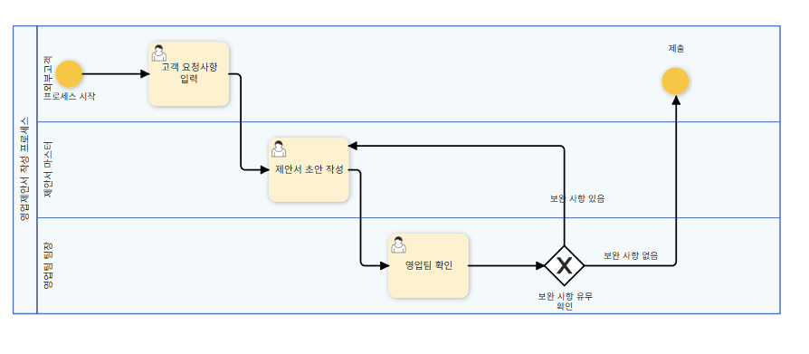
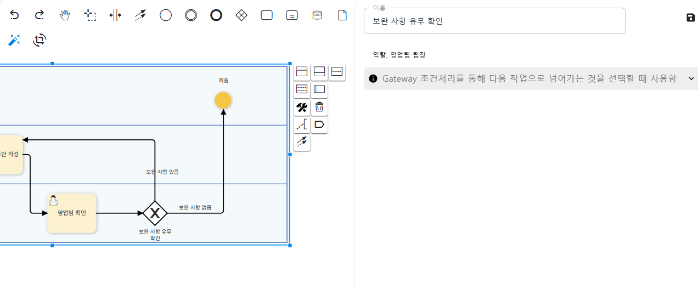
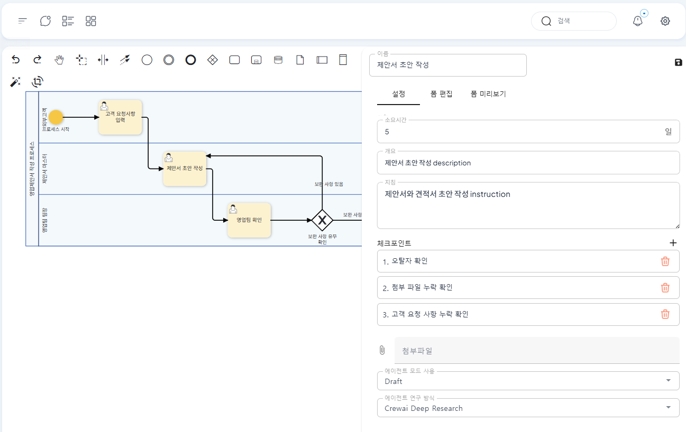
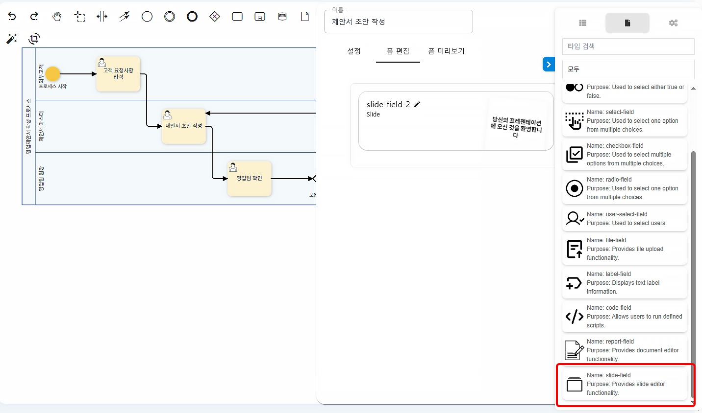
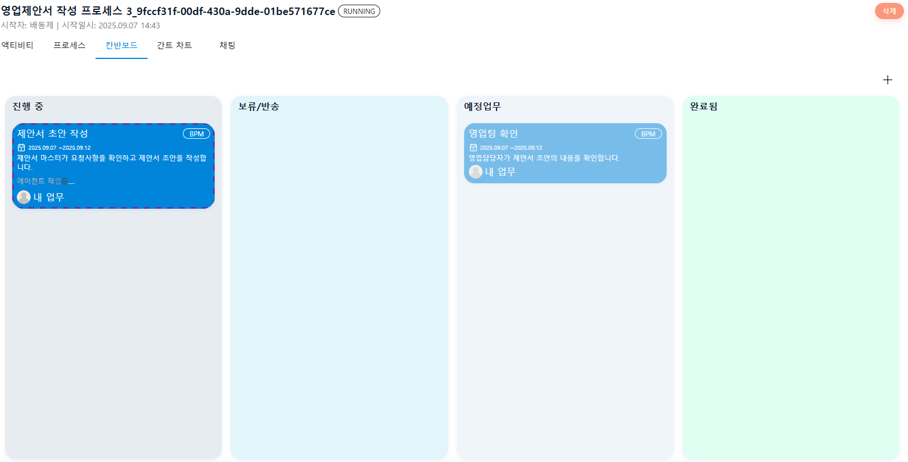
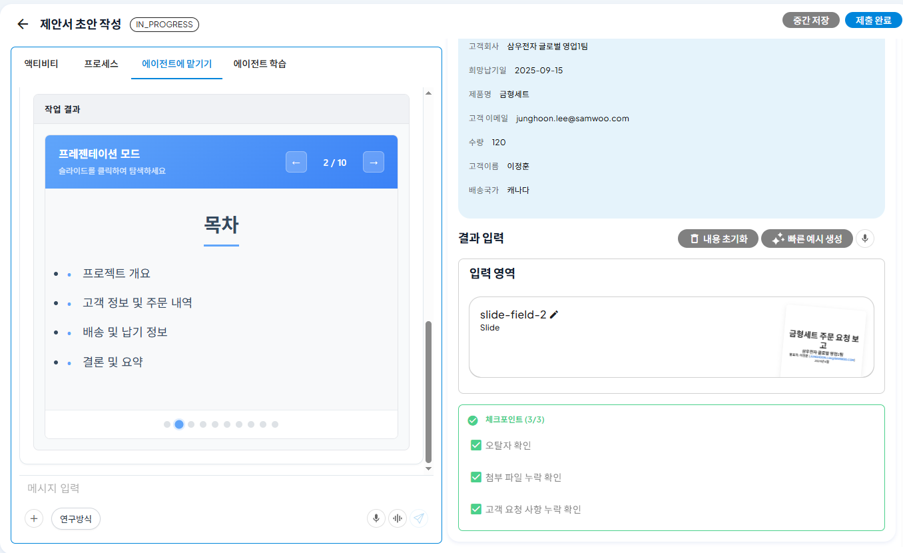
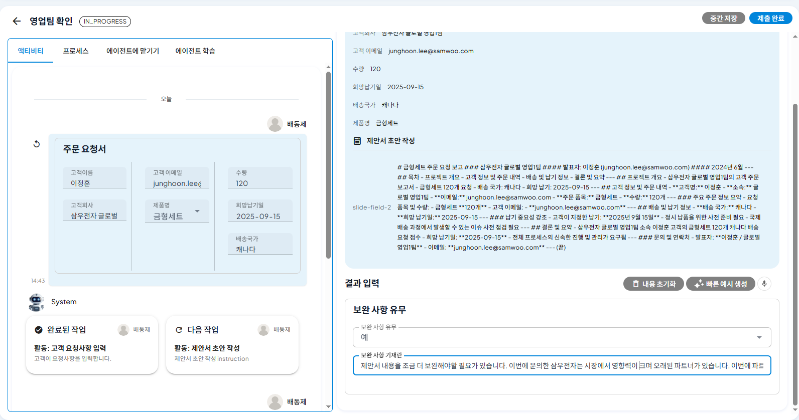
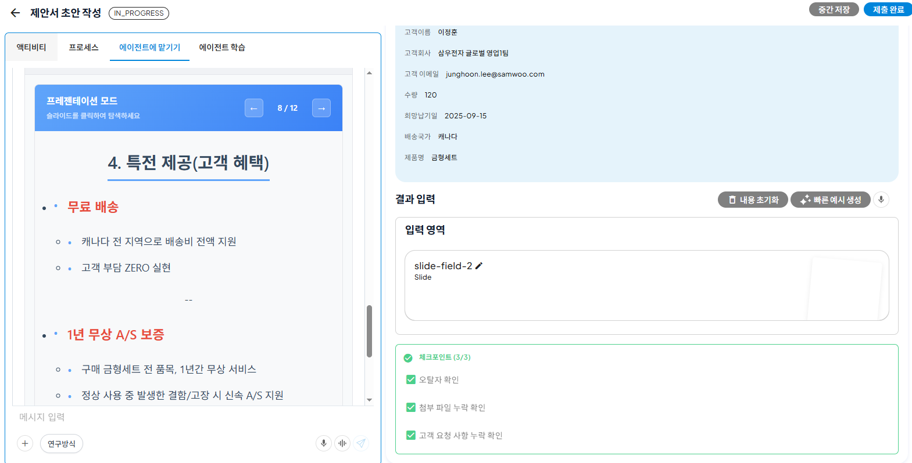

# 조건 분기 설정과 피드백 반영

## 영업활동프로세스로 따라하는 ProcessGPT 튜토리얼 Lv.3

본 튜토리얼은 **AI 에이전트**가 작성한 영업 제안서 초안을 영업팀 팀장의 피드백에 따라 수정·보완하는 과정을 안내합니다. 
제안서 작성 시 오탈자, 첨부 자료 누락, 고객 요청 반영 여부 등 단순 검토는 에이전트가 수행하고, 전략적 판단이 필요한 리뷰는 영업팀 팀장이 담당합니다.

### 프로세스 수정

좌측 정의관리에서 Lv2에서 생성한 프로세스를 선택 후 우측 연필아이콘을 클릭하면 직접 수정이 가능합니다.

1. 상단의 아이콘 중 “독점 게이트 웨이 생성” 을 클릭 후 프로세스에 추가합니다.

 

2. 추가 후 레인을 클릭 후 “보완사항있음”과 같은 설명을 입력합니다. 영업팀 팀장이 초안을 검토해 보완 사항이 있으면 에이전트에게 수정 지시를 내려 재작성하게 하고, 없으면 고객에게 제출합니다.

### 폼 수정

1. 제안서 초안 작성 워크아이템에서 체크포인트 설정을 통해, 오탈자, 첨부 파일 누락, 고객요청 사항 누락 확인과 같이 단순 반복적인 검토는 생성한 에이전트가 자동으로 실행할 수 있도록 설정합니다.

 

2. 제안서를 슬라이드 양식으로 작성할 수 있습니다.

 

### 실행

1. 프로세스를 실행하고 고객의 요청사항을 입력하면 에이전트가 제안서 초안 작성을 시작합니다.

 

2. 에이전트가 작성한 제안서 초안은 슬라이드 형태로 확인할 수 있으며, 폼 작성 시 설정한 대로 오탈자, 첨부 파일, 고객 요청 사항 누락 등 단순 검토는 에이전트가 수행합니다.

 

### 피드백 및 보완

1. 에이전트가 작성한 초안에 대해 영업팀 담당자가 보완을 지시합니다. 고객사에 특전으로 배송비를 자사 부담과, 무상 A/S 1년을 보증하는 내용을 추가할 것을 지시합니다.

 

2. 에이전트는 영업팀 담당자의 보완사항을 반영하여 제안서 슬라이드를 수정합니다.

 

3. 영업팀 담당자는 보완된 제안서를 검토 후, 보완 사항이 없다면 고객에게 제안서를 전달하면서 프로세스를 종료합니다.

