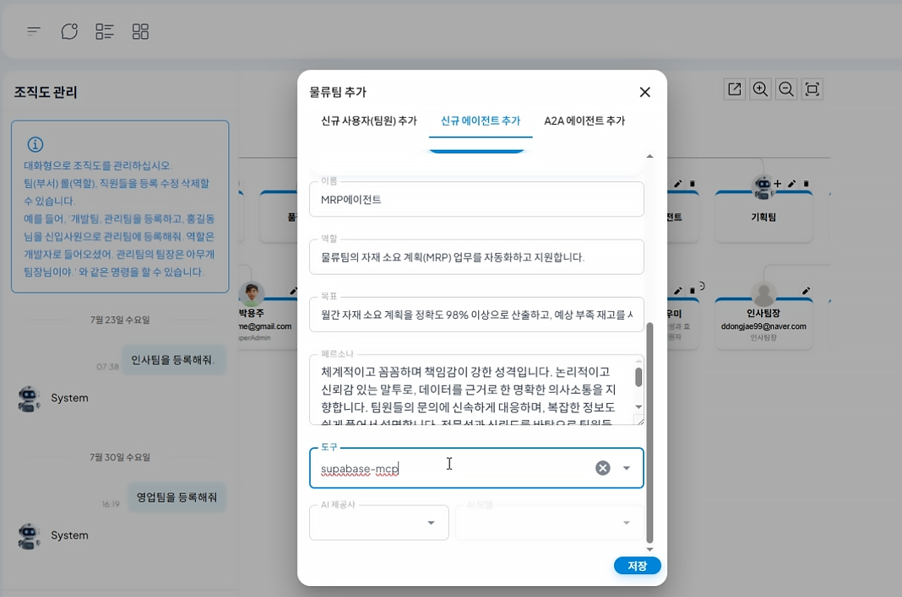

# ERP 데이터 연동을 통한 재고 관리

## 주문처리프로세스로 따라하는 ProcessGPT 튜토리얼 Lv.4

본 튜토리얼은 **AI 에이전트**와 ERP 데이터를 연동하여 수행하는 재고 관리 프로세스를 안내합니다. 
에이전트는 외부 ERP 데이터를 기반으로 재고를 확인하고 입·출고를 처리합니다. 재고가 부족할 경우 생산을 요청하여 부족분을 보충한 뒤 출고를 진행합니다.

### MRP 에이전트 등록 및 재고 관리를 위한 도구 부여

1. 조직도에 물류팀을 등록 후, ERP에이전트를 등록합니다. 에이전트의 역할, 목표, 정의하고, 필요한 도구를 부여합니다.

 

### Supabase 연동

1. 우측 상단 설정 > 데이터소스 > 접속 정보 추가를 선택하고 ERP 데이터 소스 정보를 입력합니다.

 

2. Supabase API Docs의 Read rows에 있는 curl 예시와 API 키를 활용하여 연동합니다.

 

### 프로세스 생성 및 폼 수정

1. 프로세스를 생성하면, 고객 요청사항 입력 시 MRP 에이전트가 ERP 데이터를 조회합니다.

- 재고가 충분할 경우 → 즉시 출고 진행
- 재고가 부족할 경우 → 생산 요청 후, 입고 완료된 제품을 출고
  

2. 워크 아이템을 선택한 뒤 채팅창에 *“supabase에 연동해줘”*라고 입력하면 ERP 데이터와 연결됩니다.

 

3. 생성된 프로세스의 폼은 실제 ERP 데이터와 연동되어, 프로세스의 물품명과 단가가 Supabase의 **product name, unit price**와 연결됩니다.

 

### 실행

1. 프로세스를 실행하고 고객의 요청사항을 입력하면 에이전트가 재고 확인을 시작합니다.

 

2. 에이전트는 고객이 주문한 히터모듈의 재고가 주문량 70개보다 많은 것을 확인 후, 바로 출고를 진행합니다.

 

3. 출고 후 남은 재고 수량도 mcp를 통해 확인할 수 있습니다.

 

4. 만약, 재고 수량이 고객의 주문 수량보다 부족할 경우, 재고 보충을 위해 금형세트 100대 생산을 요청합니다.

 

5. 생산이 완료되면 에이전트가 입고를 처리하며, ERP 데이터에서도 수량이 반영됩니다.

 

6. 이후 재고가 충분해지면 출고를 진행하고, 남은 재고 수량 역시 ERP에서 확인할 수 있습니다.

 

7. 출고가 완료되면 프로세스가 종료됩니다.