# 멀티플 인스턴스로 실행하는 고객 맞춤 뉴스레터 프로세스

## VIP 뉴스레터 프로세스로 따라하는 ProcessGPT 튜토리얼 Lv.5

본 튜토리얼은 AI 에이전트와 고객 데이터를 연동하여 각 VIP 고객별 맞춤 뉴스레터를 작성하고 발송하는 프로세스를 안내합니다.  
에이전트는 수집된 VIP 정보를 기반으로 고객의 관심사와 등급에 맞춘 뉴스레터를 생성하며, 멀티플 인스턴스 기능을 통해 동일한 프로세스가 고객별로 동시에 실행됩니다.  
따라서 각 고객은 자신에게 최적화된 커스텀 뉴스레터를 자동으로 받아볼 수 있습니다.  
생성된 초안은 리뷰 과정을 거쳐 승인되면 자동 발송되며, 발송 결과 또한 고객 단위로 개별 확인이 가능합니다.

 

### 고객관리 에이전트 선언 및 교육

1. 조직도에 마케팅팀을 등록한 뒤, 고객관리 에이전트를 생성합니다.
   에이전트의 역할과 목표를 정의하고 필요한 도구를 부여한 후, 고객관리에 필요한 지식을 학습시킵니다.

 

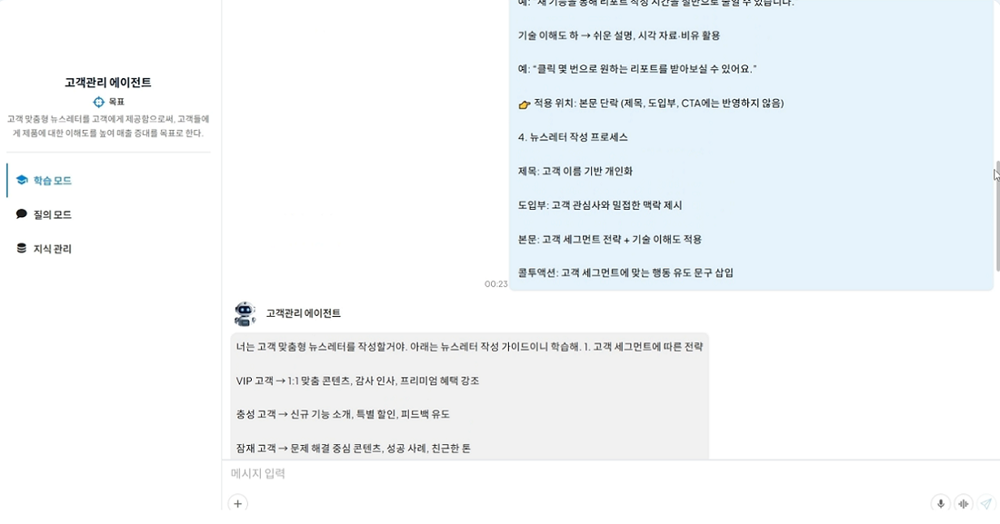
 

### CRM 데이터 연동 (Supabase 활용)

1. 우측 상단 설정 > 데이터소스 메뉴에서 접속 정보를 추가하고 사용할 CRM 데이터 소스 정보를 입력합니다.
(본 튜토리얼에서는 Supabase를 예시로 사용합니다.)

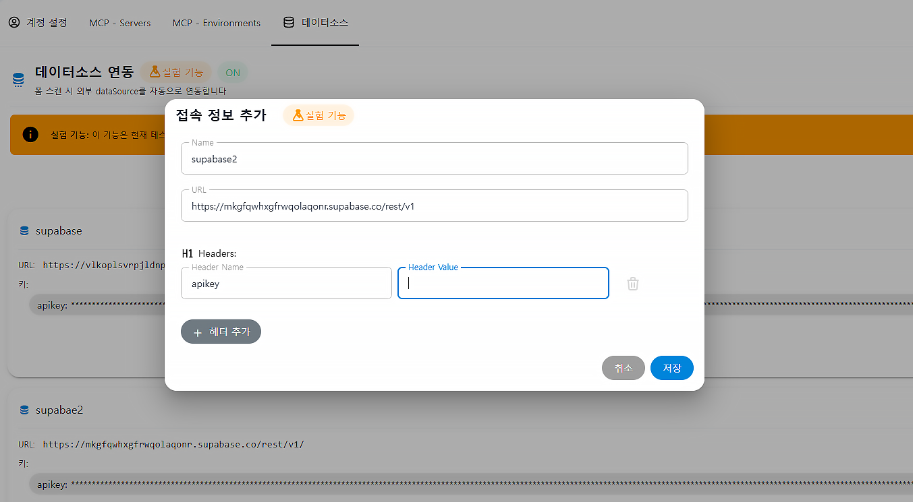
 

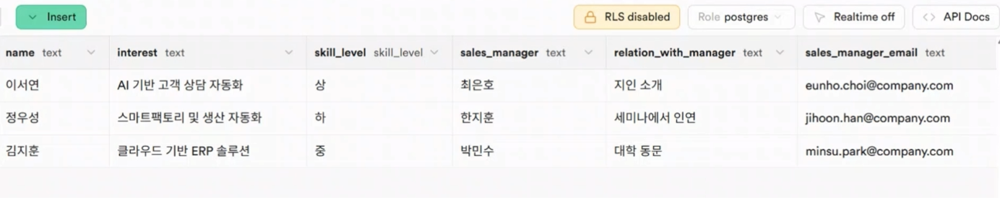
 

2. Supabase API Docs의 Read rows에 있는 curl 예시와 API 키를 활용하여 연동합니다.

 

### 프로세스 생성 및 폼 수정

1. 정의 관리에서 프로세스를 생성합니다.
   상단의 “확장된 하위 프로세스 생성” 아이콘을 클릭하여 멀티플인스턴스를 실행할 프로세스를 설정합니다.
   멀티플 인스턴스를 설정하면 프로세스가 고객 단위로 분기되어, 각 고객별로 맞춤형 메일 작성 및 발송 프로세스가 병렬로 실행됩니다.

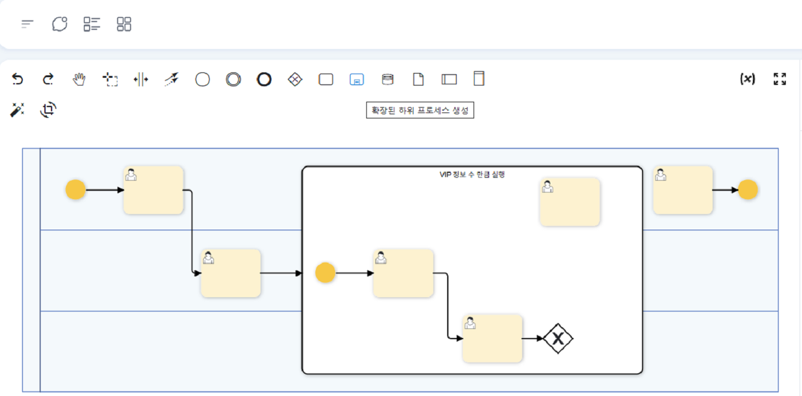
 

2. 프로세스 생성 후, 각 task의 폼을 용도에 맞게 수정합니다.
   task의 설정과 사용할 에이전트에 대한 설정, Supabase와의 연동을 아래와 같이 진행합니다.

 

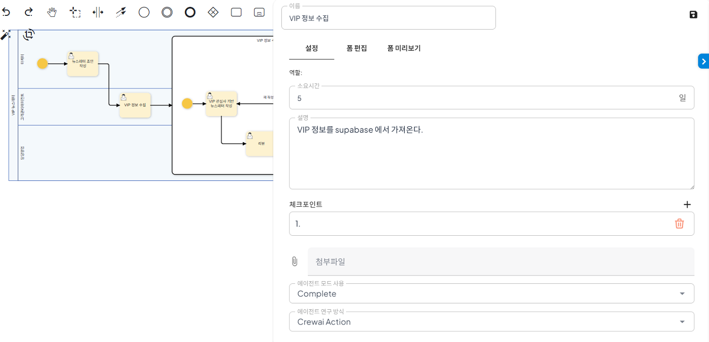
 

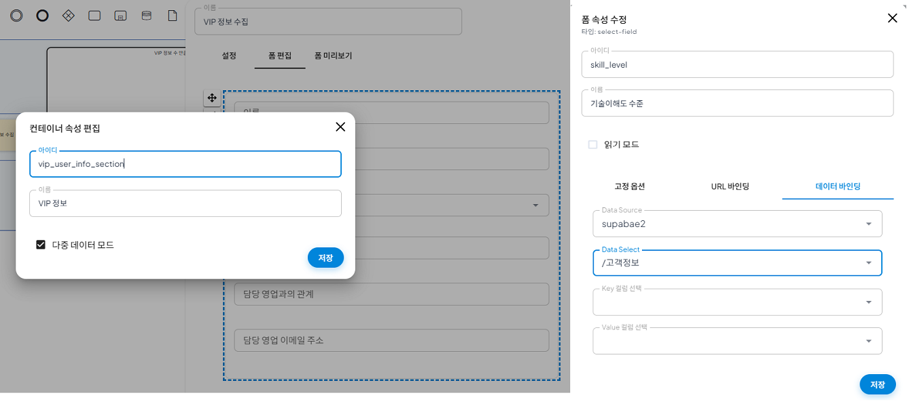
 

### 에이전트의 고객 맞춤형 뉴스레터 작성

1. 프로세스를 실행하여 뉴스레터 초안을 작성합니다.
   좌측 하단의 소스 추가 기능을 활용해 참고할 파일을 업로드하거나,
   "빠른 예시"를 클릭하여 LLM을 기반 자동 초안을 생성할 수도 있습니다.

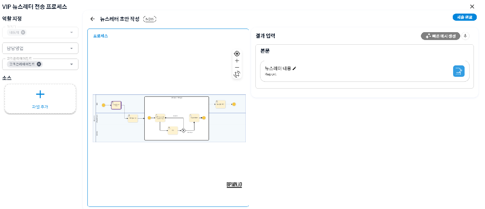
 

2. 생성된 초안을 바탕으로 에이전트는 부여된 Supabase mcp 도구를 활용해, CRM 데이터에 연동된 고객의 정보를 확인하고, 이를 기반으로 각각의 고객 맞춤형 뉴스레터를 생성합니다

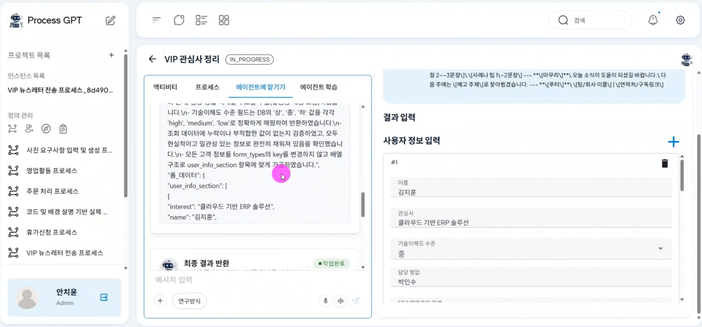
 

 

3. CRM 데이터에 연동된 3명의 고객을 위해 생성된 맞춤형 뉴스레터 입니다.

아래 이미지와 같이 사내 CRM 데이터를 활용하여 고객별 맞춤형 뉴스레터가 생성됩니다.

 

이서연 고객을 대상으로 작성된 뉴스레터 입니다. 지인의 소개와 AI기반 고객 상담자동화에 대한 고객의 관심사를 타겟으로 한 뉴스레터를 작성합니다

 

.png)
 

세미나에서 알게된 정우성 고객에게는 스마트팩토리 및 생산자동화라는 고객의 관심사에 맞춰 뉴스레터가 제작됩니다.

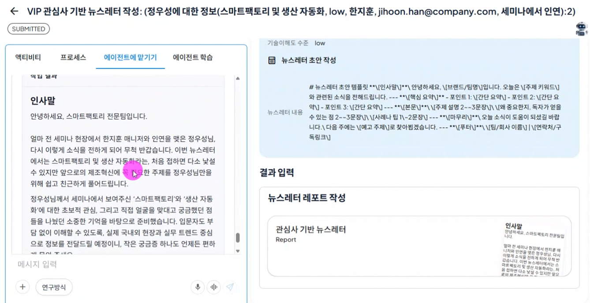
 

.png)
 

김지훈 고객에게는 대학동문으로서의 유대감과 고객의 관심사인 클라우드 기반 ERP 솔루션에 대한 내용을 담은 뉴스레터를 생성합니다.

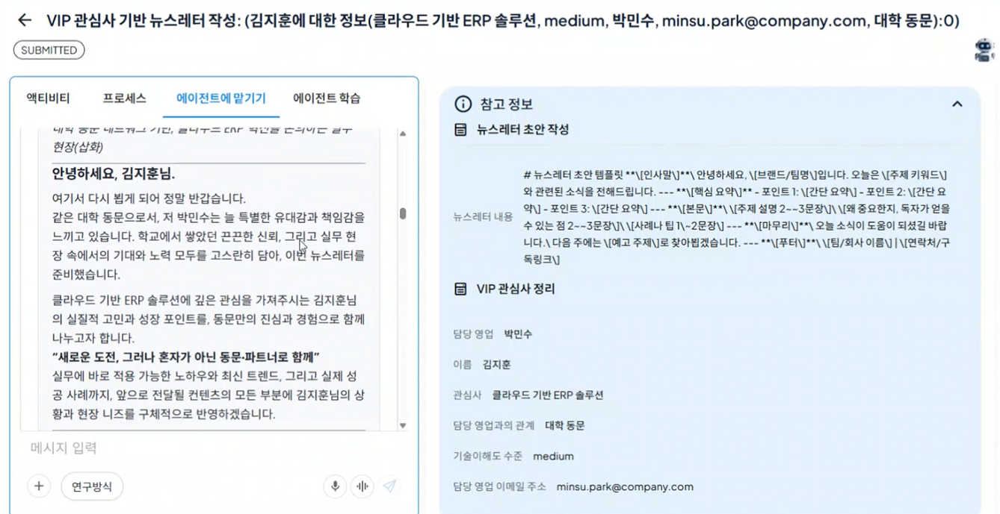
 

.png)
 

### 리뷰

1. 유저인 결정권자는 에이전트가 작성한 초안을 검토합니다. 결과물에 따라 승인(결재 완료)와 재작성을 지시할 수 있습니다.

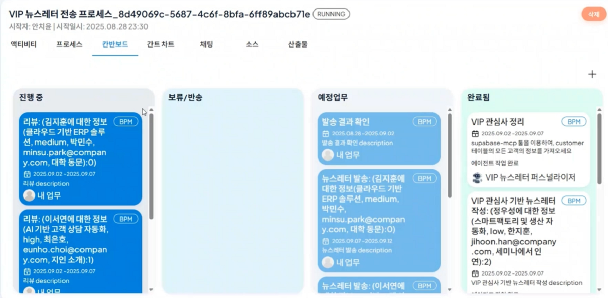
 

2. 결제 완료된 뉴스레터는 CRM 데이터에 등록된 고객의 메일 주소로 발송됩니다.
   

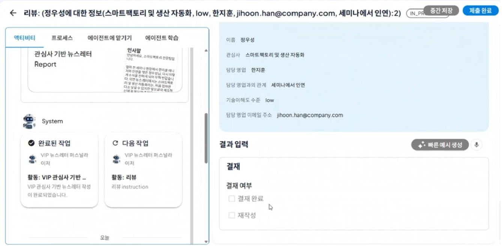
 

 

 

### 피드백 검증 및 조건 기반 승인

1. 에이전트가 작성한 초안에 대해 결정권자가 재작성 의견과 피드백을 에이전트에게 전달하고, 에이전트는 리뷰 내용을 반영하여 재작성합니다.

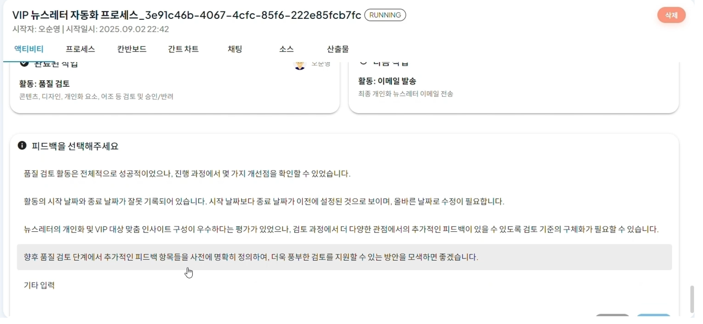
 

 
